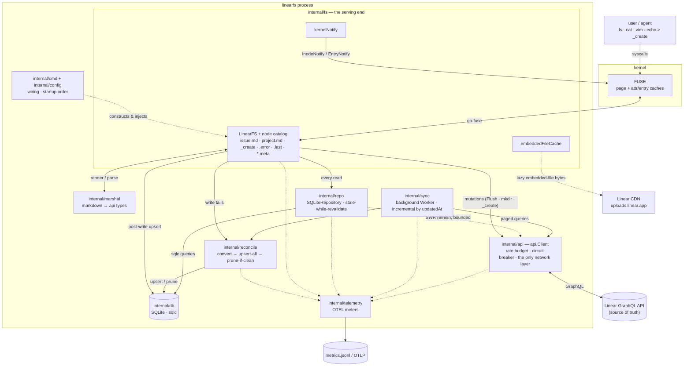

# LinearFS Architecture

LinearFS exposes Linear.app as a FUSE filesystem: issues, projects, initiatives,
and team metadata appear as a navigable directory tree of editable markdown files.
Editing a file's YAML frontmatter or body updates Linear; the filesystem is the UI,
the Linear API is the source of truth, and SQLite is a persistent cache in between.

This document maps the subsystems and, more importantly, **how they interact**.
For per-package internals see the source; this is the orientation map.

## System diagram



Reading the graph: solid arrows on the left half are the **read path** (user →
FUSE → fs → repo → SQLite, never the network); the right half is **ingest**
(worker → api.Client → Linear, reconciled into SQLite) and the **write path**
(fs → api.Client → Linear, then backfilled into SQLite and punched through the
kernel caches via `kernelNotify`). Dotted arrows are background/lazy/cross-cutting.

## The pipeline

The system is a one-directional read pipeline with a side-channel for writes:

```
                 reads (background, every ~2 min)
  Linear API ──> api.Client ──> Sync Worker ──> SQLite ──> Repository ──> LinearFS ──> FUSE ──> user
   (truth)                       (ingest)       (cache)     (read API)    (nodes)    (kernel)

                 writes (synchronous, on save)
  user ──> FUSE ──> LinearFS.Flush ──> api.Client ──> Linear API
                          │                                │
                          └──────── upsert ──> SQLite <────┘ (read-your-writes refetch)
```

Two rules govern the whole design:

1. **Reads never touch the network.** Every read is served from SQLite via the
   Repository. There is no blocking cold-cache fetch: a read returns whatever
   SQLite holds and, when a sub-resource looks stale, kicks a **non-blocking**
   background refresh (stale-while-revalidate). The Sync Worker keeps SQLite
   fresh in the background.
2. **Writes go straight to the API, then backfill the cache.** The `api.Client`
   only talks to Linear — it never writes SQLite. The FUSE write handlers
   (`Flush`, `Mkdir`, `_create`) are responsible for upserting the result into
   SQLite and invalidating kernel caches so the next read sees fresh data.

This decoupling is deliberate: ingest (Sync Worker → SQLite) and serve
(SQLite → Repository → FUSE) are separate concerns, joined only by the database.
The upsert-then-prune tail both sides share lives in `internal/reconcile`.

## Subsystems

### `internal/api` — Linear GraphQL client (the only network layer)

The lowest layer and the only one that makes HTTP calls. It has no internal
dependencies. Exposes ~31 query methods (`GetTeamIssuesPage`, `GetTeamMetadata`,
`GetInitiativesProbe`, `GetIssueDetailsBatch`, …) and ~26 mutation methods
(`UpdateIssue`, `CreateComment`, `CreateLabel`, …). Types in `types.go` mirror
Linear's schema; queries in `queries.go` are built from 17 shared GraphQL
fragments (`IssueFields`, `IssueFieldsLite`, `CommentFields`, …) concatenated as
Go string constants. Two fragment rules prevent silent drift:

- A combined query and its **drain-page twin** must project through the same
  fragment, or nodes past page one silently carry zero values.
- Every **mutation response** must project through the entity's fragment, not an
  inlined field list (the attachment mutations once drifted and dropped fields).

**Read-fetch envelope** (`fetch.go`, `paginate.go`): all responses decode through
`fetchOne` / `fetchNodes` / `fetchConn` over a shared `walkPath`. A null terminal
is an **error** (not a silent zero value), and `fetchNodes` trips loudly if a
connection reports `hasNextPage` — paginated reads must drain via `fetchAll`,
which guards against stalled/repeating cursors and caps runaway pagination.

Operational guards:

- **Rate budget** (`ratebudget.go`): dual-axis — request count *and* GraphQL
  complexity points — anchored to the server's `X-RateLimit-*` /
  `X-Complexity-*` response headers rather than hardcoded limits (seeded at
  2,500 req/hr until the first response arrives). Operations are classed into
  priority tiers, each with a reserve fraction of budget it may not eat into
  (writes 0% — they always win — up to bulk detail fetches at 40%), plus a
  16-token micro-burst limiter for pacing.
- **Circuit breaker** (`client.go`): after 5 consecutive network errors, opens
  for 30s to stop wasting budget during an outage.
- **Metrics** (`metrics.go`): OTEL counters/histograms for per-op requests,
  latency, complexity, and budget decisions (admit/defer/wait/ratelimited).
- **Request log** (`requestlog.go`): optional JSONL trace of every completed
  request (op, vars, duration, outcome, complexity) to
  `~/.config/linearfs/requests.jsonl`, for offline diagnosis.
- **Error predicates** (`errors.go`): `IsRateLimited`, `IsNotFound`,
  `IsFieldTooLong` — the vocabulary the fs layer's error classifier maps to
  errnos.

**Consumed by:** Sync Worker (reads), Repository (SWR refreshes), LinearFS
(mutations plus a few interactive re-checks), reconcile (authoritative ID sets).
Its types flow everywhere.

### `internal/sync` — background ingest worker

The ingest side of the pipeline. `Worker` (`worker.go`) runs a goroutine on a
~2-minute ticker, started with the mount-lifetime context and stopped on
unmount. Cycles come in two sizes:

- **Lean cycle** (the steady state): a cheap initiatives *probe*, per-team
  project probes, and per-team incremental issue sync. Skips the expensive
  workspace and team-metadata drains — this "sync-cycle diet" cut steady-state
  complexity spend by roughly an order of magnitude.
- **Full cycle** (every ~10 minutes): additionally re-syncs the workspace
  (initiatives, projects) and full team metadata (states, labels, members,
  cycles).

Each cycle, in order: drain the `pending_detail_sync` queue → workspace or
probe → teams list → per-team (metadata or probe, then issues) → the scheduled
issue-ID reconcile sweep.

- **Incremental strategy:** issues are fetched ordered by `updatedAt DESC` and
  pagination stops at the first page whose issues are all older than the
  `sync_meta.last_issue_updated_at` cursor.
- **Detail batching:** comments/docs/attachments/relations are fetched 10 issues
  at a time (`GetIssueDetailsBatch`); 15 exceeded Linear's 10k per-query
  complexity cap.
- **Rate-limit aware:** at 80% hourly budget the whole cycle is skipped; at 70%
  (or after any rate-limit response) detail fetches are deferred into the
  `pending_detail_sync` table and drained in later cycles. `syncDetails` returns
  a `detailOutcome` ledger (synced / deferred / gated) and stamps
  `detail_synced_at` only for issues whose details persisted cleanly.
- **Catch-up mode:** when a cycle changes >50 issues, it relaxes the
  Repository's staleness threshold (5 min → 30 min) so on-demand refreshes don't
  duplicate work the worker is already doing.
- **Clock seam:** all time access goes through injected `now` / `newTimer` /
  `newTicker` fields (`clock.go`) — no bare `time.Now`/`time.Sleep` in the
  worker, so tests never sleep.

**Reads from** `api.Client`; **writes to** `db.Store` directly
(`store.Queries().Upsert*`) with `reconcile.Collection` as the prune-safe tail.
It does not go through the Repository for writes.

### `internal/reconcile` — the shared upsert-then-prune tail

A small package owning the one algorithm both ingest paths share:
`Collection(spec)` upserts every fetched item and prunes local rows **only if
every upsert succeeded** (the "clean" guard) — a failed upsert must never
license deleting rows the fetch simply didn't cover. Callers decide whether
prune is licensed at all (nil `Prune` for capped/partial fetches).

- `PersistIssueDetails` applies it to the five per-issue detail collections
  (comments, docs, attachments, relations, inverse relations).
- `Extractor` parses Linear-CDN URLs out of markdown bodies and upserts
  embedded-file rows (the I/O tail of a pure, unit-tested parser).

**Called by:** the Sync Worker (workspace/metadata/details), the Repository's
SWR refreshes, and fs write tails (attachments, links).

### `internal/db` — SQLite persistence (sqlc)

The cache and single source of truth for the running process. `schema.sql`
defines 26 tables; queries in `queries.sql` are compiled to type-safe Go by
**sqlc**. `convert.go` holds the bidirectional converters between `api.*` types
and DB rows.

Design conventions:
- **Hybrid storage:** queryable fields are extracted into indexed columns
  (`team_id`, `state_id`, `updated_at`, …) while the full API response is kept in
  a `data JSON` column. Avoids joins (names stored alongside IDs) and keeps the
  schema stable as Linear's API grows.
- **`synced_at` everywhere** for staleness detection; issues additionally carry
  `detail_synced_at`, stamped only when a detail batch persisted cleanly.
- **Hydrate-then-overlay:** reverse converters unmarshal the `data` blob first,
  then overlay the columns — so no field is silently dropped, and a corrupt blob
  degrades to column-backed values instead of poisoning a listing.
- **Time-format gotcha:** the driver uses `_time_format=sqlite`, so timestamps
  come back space-separated, not RFC3339 `T`, and `time.Parse(time.RFC3339, …)`
  fails silently. Always use `ParseSQLiteTime` / `ParseSQLiteTimeAny`
  (`timeparse.go`); never parse a SQLite value directly.
- **`Store.WithTx`** wraps multi-table updates in a transaction.
- **Migrations:** `migrateSchema` applies targeted, idempotent `ALTER TABLE`
  migrations (probe via `PRAGMA table_info`, add if missing); the blunt fallback
  — drop and recreate from the embedded schema on "no such column/table" — still
  exists because the DB is a disposable cache.

**Consumed by:** Sync Worker and reconcile (writes), Repository (reads),
LinearFS handlers (direct upserts/deletes after mutations).

### `internal/repo` — the read layer

The seam between storage and the filesystem: the concrete **`SQLiteRepository`**
(~48 exported methods across issues, comments, docs, labels, projects,
milestones, initiatives, relations, attachments, and the "my" views). A
`Repository` interface with an in-memory mock existed for years without a second
consumer and was deliberately deleted — the header comment in `sqlite.go` says
to re-extract it mechanically if a real second adapter ever appears.

- **`queryOne[R, T]`** (`queryone.go`) canonicalizes single-row getters:
  not-found → `(nil, nil)`, fetch errors labeled with the op, convert errors
  propagated.
- **Stale-while-revalidate** (`swr.go`): `maybeRefreshSWR` is the single owner
  of refresh policy — every sub-resource surface routes through it with an
  `swrSpec` (staleness rule, refresh func, orphan classification). Refreshes are
  non-blocking, bounded by a 10-slot semaphore and a 30s timeout. Staleness is
  either TTL-based (5 min; 30 min in catch-up mode) or event-driven
  (`detail_synced_at` older than the entity's `updatedAt`).
- **Orphan handling:** a refresh that hits Linear's "Entity not found"
  cascade-deletes the local rows (issue → its comments/docs/attachments/
  relations/history; likewise projects and initiatives) and schedules a
  reconciliation pass (rate-limited to every ~6h) that diffs local IDs against
  the authoritative API sets. The worker also runs a scheduled issue-ID
  reconcile each cycle window.

**Reads from** `db.Store`; uses `api.Client` only for background SWR refreshes —
a read call itself never blocks on the network. **Consumed by:** LinearFS for
every read.

### `internal/marshal` — markdown ↔ Linear translation

The format boundary. Converts `api.*` objects to markdown (YAML frontmatter +
body) for display, and parses edited markdown back into partial update maps.
Parsing is `yaml.v3` end to end (the hand-rolled frontmatter scanner is gone),
and malformed input — e.g. unclosed frontmatter — is rejected loudly rather
than silently treated as body text.

- Symmetric pairs: `IssueToMarkdown` ↔ `MarkdownToIssueUpdate`, plus document,
  milestone, and history variants; `Render` builds frontmatter documents for the
  generated catalog files too.
- **Partial updates:** `MarkdownToIssueUpdate` diffs against the original and
  returns only changed fields.
- **Field clearing:** a deleted frontmatter line becomes an explicit `nil`/`[]`
  in the update map (e.g. removing `assignee:` clears the assignee).
- **`FieldError`** lives here: a structured field/value/reason error the fs
  layer maps to errno + `.error` content (fs re-exports an alias).
- **ID resolution is deferred:** frontmatter holds human-friendly values
  (assignee *email*, label *names*, project *name*); marshal leaves them as-is
  and the fs layer resolves them to Linear IDs before calling the API. Helpers
  like `ScalarToString` / `StringSliceFromYAML` canonicalize YAML scalars.

**Consumed by** `internal/fs` only. Depends on `yaml.v3` and `api` types.

### `internal/fs` — the FUSE filesystem (the core, ~54 non-test files)

The serving end and the largest package, built on `go-fuse/v2`. The root struct
`LinearFS` (`linearfs.go`) is sectioned:

- **API seam:** the `api.Client` plus two injectable interfaces —
  `MutationClient` (`mutationclient.go`, every mutation; swappable in tests via
  `testutil/mockmutation`) and a `verifyReader` for read-your-writes refetches.
- **Persistence:** `SQLiteRepository` (all reads), `db.Store`, the
  `sync.Worker`, and the mount-lifetime `lifeCtx`/`spawn` pair that ties every
  background goroutine to unmount.
- **Sub-modules (embedded structs):** `writeFeedback` (the `.error` *and*
  `.last` state), `embeddedFileCache` (memory → disk → CDN bytes for embedded
  files), and `kernelNotify` (the only coupling to `*fuse.Server`, for cache
  invalidation).

Rather than one node type per path, most surfaces compose a small set of
building blocks: `renderFile` (any read-only generated file — `.meta` sidecars,
`states.md`, `history.md`, the mount README), `dirManifest` + `attrNode`
(static directory children and attrs), `namedListing`/`indexedListing`
(name-addressed and sequence-addressed collections), `editBuffer` (the
read/write buffer under every editable file), `ino(kind, id)` (one FNV-based
inode namespace, stable across remounts), and a `nodeRefresher` seam so a
re-looked-up node re-reads fresh entity data (go-fuse reuses the first node
per inode). `resolveByName` collapses the name→ID resolvers.

**Read flow:** kernel → `Lookup`/`Readdir`/`Read` → Repository → SQLite →
marshal to markdown bytes. `mtime` = `updatedAt`, `ctime` = `createdAt`.

**Write flow (the important interaction):**
1. `Write` buffers bytes in the `editBuffer`; `Flush` parses the markdown via
   `marshal`. Editor save-via-rename (temp file + `rename`) is caught by a
   scratch node and routed through the same path (`atomicwrite.go`,
   `renamesave.go`).
2. The fs layer **resolves names to IDs** (status→stateId, assignee
   email→userId, labels→labelIds, project/milestone/cycle/parent→IDs). Edits
   decompose into shared halves: `scalarEdit` (name/body), `labelsEdit`,
   `reconcileLinks` (initiative/project links).
3. On valid input, calls the `MutationClient`. `classifyMutationErr`
   (`createcommit.go`) is the single owner of the failure model: bad input →
   `EINVAL`, over-length field → `EMSGSIZE`, rate-limit/timeout → `EAGAIN`,
   backend failure → `EIO` — reason always written to `.error`.
4. **Read-your-writes** (`editcommit.go`): refetches the entity, normalizes
   benign markdown reformatting, and flags a silent revert/truncation as `EIO`.
5. **Upserts the fresh result into SQLite** (collection surfaces go through the
   `reconcile` write tails) and invalidates both internal and kernel caches —
   `InvalidateKernelInode` for directory listings, `InvalidateKernelEntry` for
   name lookups.

**Special filesystem semantics:**
- **`_create` trigger files** (write-only, mode 0200): reads are rejected with
  `EACCES`; a write creates an item (issue, comment, doc, label, attachment,
  relation, update, …). Read-before-write editors can't use them — pipe content
  instead.
- **`.error` / `.last` sidecars** (read-only, backed by `writeFeedback`): every
  writable surface exposes the last failure's reason in `.error` (cleared on
  success) and, where the surface mints an entity, the created identity/URL in
  `.last` — so scripts and LLMs never have to parse an errno.
- **`.meta` sidecars:** editable files hold *only* editable fields; the
  server-managed fields (id, url, timestamps, …) render into a read-only
  `<name>.meta` twin. Editing a server field is impossible by construction.
- **Generated README:** the mount root's `README.md` is generated at runtime by
  `generateReadme` (`root.go`) and is the primary doc agents read. Any change to
  a filesystem surface or contract must update it in the same change;
  `TestGeneratedReadmeMatchesBehavior` guards against drift.

**Consumed by** `internal/cmd` (which mounts it).

### `internal/telemetry` — OTEL metrics pipeline

Owns the meter provider the other packages record into (api, sync, repo,
reconcile, fs). Two sinks: an always-on 5-minute summary exporter to
journald/logs, and a config-gated file exporter writing one compact JSON line
per interval to `~/.config/linearfs/metrics.jsonl` (diagnosis = `jq` over that
file). Exporter failure degrades to summary-only — telemetry must never take
the mount down. The per-request `requests.jsonl` log (see `internal/api`) is
configured here too.

### `internal/cmd` + `cmd/linearfs` + `internal/config` — wiring

`cmd/linearfs/main.go` calls `cmd.Execute()` (Cobra). Commands: `mount`
(with `--foreground`/`-f`, `--debug`/`-d`) and `version`. **Startup order**
(`mount.go` → `linearfs.go`):

1. `config.Load()` — reads `LINEAR_API_KEY` (env overrides file) and
   `~/.config/linearfs/config.yaml` (or `$XDG_CONFIG_HOME`). API key required.
2. `fs.PreflightMountpoint(...)` — detects and heals a wedged/stale FUSE mount
   at the target before mounting over it.
3. `telemetry.Init(...)` — metrics pipeline up before anything records.
4. `fs.NewLinearFS(cfg, debug)` — builds the `api.Client`; repo/store still nil.
5. `lfs.EnableSQLiteCache("")` — opens the cache DB (default via
   `db.DefaultDBPath()`: `os.UserConfigDir()/linearfs/cache.db` — deliberately
   *outside* the mountpoint), loads the cached viewer, builds
   `SQLiteRepository`, and starts the `sync.Worker` under `lifeCtx`.
6. `fs.MountFS(...)` — creates the root node, mounts via go-fuse (attr/entry
   timeouts 60s/30s), hands the server ref to `kernelNotify`.
7. On SIGINT/SIGTERM: unmount, then `lfs.Close()` — cancel `lifeCtx`, wait for
   spawned goroutines, stop the worker, close repo, store, and request log.

`internal/config` defines the config struct and load logic (including the
telemetry file/requests sections). `internal/testutil` provides test fixtures
and `mockmutation`, the in-memory fake behind the `MutationClient` seam.

## How the pieces fit together (interaction summary)

| Interaction | Direction | Mechanism |
|---|---|---|
| Sync Worker ← Linear | read | `api.Client` queries, lean/full cycles, incremental by `updatedAt` |
| Sync Worker → SQLite | write | `store.Queries().Upsert*` + `reconcile.Collection` tail (not via repo) |
| Repository ← SQLite | read | sqlc queries + hydrate-then-overlay converters → `api.*` types |
| Repository → Linear | background | SWR refreshes via `maybeRefreshSWR`, semaphore-bounded, never blocking |
| LinearFS ← Repository | read | ~48 concrete methods, every FUSE read |
| LinearFS ↔ marshal | both | `api.*` ↔ markdown; fs resolves names→IDs |
| LinearFS → Linear | write | `MutationClient` mutations on `Flush`/`_create`/`Mkdir` |
| LinearFS → SQLite | write | upsert fresh result after each mutation (collections via reconcile) |
| LinearFS → kernel | invalidate | `kernelNotify`: `InvalidateKernelInode`/`Entry` after writes |
| everything → telemetry | record | OTEL instruments → summary log + `metrics.jsonl` |
| cmd → everything | wiring | constructs and injects in startup order |

## Cross-cutting concerns

- **Caching is layered:** kernel page/attr cache → go-fuse node cache → SQLite.
  Writes must punch through the kernel layer explicitly via
  `InodeNotify`/`EntryNotify`, or stale listings persist; re-looked-up nodes
  must re-read entity data via the `nodeRefresher` seam, or remote edits never
  appear.
- **Rate budget is the scarce resource:** the client's dual-axis budget, the
  worker's lean cycles / 80%-skip / 70%-defer thresholds, and the tiered
  reserves all exist to keep the mount responsive within Linear's complexity
  budget. Writes always win.
- **Staleness coordination:** `synced_at` + `detail_synced_at` columns, the SWR
  coordinator, the worker's incremental cursor, and catch-up mode all
  coordinate so the worker and on-demand refreshes don't duplicate work.
- **Error surfacing contract:** every writable surface has a `.error` sibling
  (and `.last` where entities are minted). Bad input → `EINVAL`, over-length →
  `EMSGSIZE`, rate-limited/timeout → `EAGAIN`, missing reference → `ENOENT`,
  backend failure → `EIO`; the reason always lands in `.error`, cleared on
  success.
- **Time handling** is the most common footgun — see the `db` section. Inside
  the worker, all clock access goes through the injected clock seam.

## Observations worth a maintainer's attention

These surfaced while mapping the code and are noted as-is, not as prescriptions:

- **Embedded-file cache path is macOS-only.** `linearfs.go` hardcodes
  `~/Library/Caches/linearfs/files` even on Linux (where `~/.cache/linearfs`
  per XDG would be expected). Embedded-file downloads land there regardless of
  OS. (The SQLite cache DB itself is XDG-correct via `os.UserConfigDir()`.)
- **`--config` flag is inert.** `root.go` defines `--config`/`-c`, but
  `mount.go` calls `config.Load()` with no path, so the config location is
  effectively hardcoded to the XDG default.
