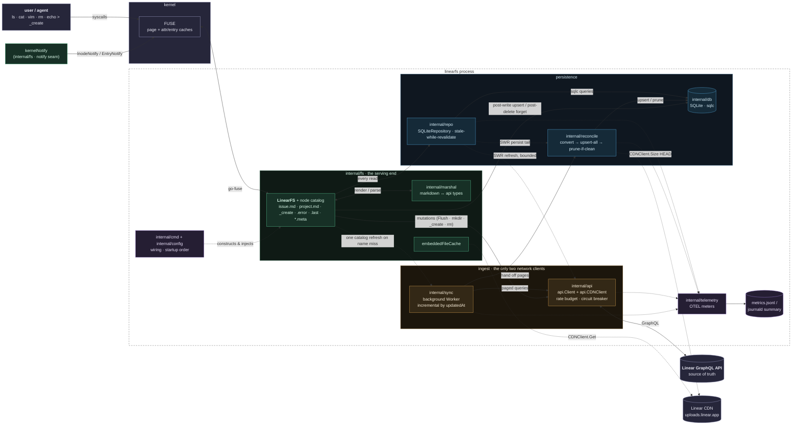

# LinearFS Architecture

LinearFS exposes Linear.app as a FUSE filesystem: issues, projects, initiatives,
and team metadata appear as a navigable directory tree of editable markdown files.
Editing a file's YAML frontmatter or body updates Linear; the filesystem is the UI,
the Linear API is the source of truth, and SQLite is a persistent cache in between.

This document maps the subsystems and, more importantly, **how they interact**.
For per-package internals see the source; this is the orientation map.

## System diagram



Reading the graph: it flows left→right along the **read path** (user → FUSE → fs
→ repo → SQLite, never the Linear API). The **serving** lane (green,
`internal/fs`) answers every read out of the **persistence** lane (blue, repo →
SQLite); the **ingest** lane (amber, worker → api.Client → Linear, reconciled
into SQLite) keeps that cache fresh in the background; and the **write path**
cuts straight from fs → api.Client → Linear, then backfills SQLite and punches
the kernel caches via `kernelNotify`. Solid arrows are the primary paths; dotted
arrows are background/lazy/cross-cutting (SWR refresh, CDN byte fetches, wiring,
telemetry). Note the one deliberate write-path → worker edge (stale-catalog
refresh) and that embedded-file bytes come from the CDN, not SQLite.

## The pipeline

The system is a one-directional read pipeline with a side-channel for writes:

```
                 reads (background, every ~2 min)
  Linear API ──> api.Client ──> Sync Worker ──> SQLite ──> Repository ──> LinearFS ──> FUSE ──> user
   (truth)                       (ingest)       (cache)     (read API)    (nodes)    (kernel)

                 writes (synchronous, on save / rm)
  user ──> FUSE ──> LinearFS commit tails ──> api.Client ──> Linear API
                          │                                      │
                          └── upsert / forget ──> SQLite <───────┘ (read-your-writes refetch)
```

Two rules govern the whole design:

1. **Reads never touch the Linear API.** Every metadata read is served from
   SQLite via the Repository, with no blocking cold-cache fetch: a read returns
   whatever SQLite holds and, when a sub-resource looks stale, kicks a
   **non-blocking** background refresh (stale-while-revalidate). The Sync Worker
   keeps SQLite fresh. Two deliberate exceptions block on the network: embedded
   attachment bytes (`*.png`, `*.pdf`) fall through memory → disk → a lazy CDN
   GET (`embeddedFileCache`), and a handful of interactive-tier synchronous
   reads (a few write-flow re-checks, e.g. the attachment-listing live
   re-check and the project read-your-writes re-fetch) — see `WithInteractive`
   under the rate budget.
2. **Writes go straight to the API, then backfill the cache.** The `api.Client`
   only talks to Linear — it never writes SQLite. The FUSE write handlers
   (`Flush`, `Mkdir`, `_create`, `rm`/`rmdir`) are responsible for upserting the
   result into — or, after a delete, forgetting the row from — SQLite and
   invalidating kernel caches so the next read sees fresh data.

This decoupling is deliberate: ingest (Sync Worker → SQLite) and serve
(SQLite → Repository → FUSE) are separate concerns, joined only by the database.
The upsert-then-prune tail lives in `internal/reconcile`, shared by the Sync
Worker and the Repository's SWR refreshes.

## Subsystems

### `internal/api` — Linear network clients (GraphQL + CDN)

The lowest layer and the only one that speaks to Linear over the network, through
exactly two clients: `api.Client` speaks the GraphQL API, and `api.CDNClient`
(`cdn.go`) speaks HTTP to Linear's uploads CDN for embedded-attachment bytes.
Both embedded-file consumers route through the one shared `CDNClient` — so CDN
traffic has one auth header, one timeout policy, and one set of OTEL instruments
(`linearfs.cdn.*`) instead of each wiring its own invisible `http.Client`:
`internal/fs`'s `embeddedFileCache` calls `CDNClient.Get` for bytes on read, and
`internal/reconcile`'s `Extractor` calls `CDNClient.Size` (a HEAD) for embedded-file
sizes during sync. Its only internal dependency is the small `internal/telemetry`
instrument-constructor helpers. Exposes 26 query methods (`GetTeamIssuesPage`,
`GetTeamMetadata`, `GetInitiativesProbe`, `GetIssueDetailsBatch`, …) backed by
31 named GraphQL operations — combined fetches like `GetTeamMetadata` issue
several (metadata query + drain-page twins) — and ~30 mutation methods
(`UpdateIssue`, `CreateComment`, `CreateLabel`, …). Types in `types.go` mirror
Linear's schema; queries in `queries.go` are built from 17 shared GraphQL
fragments (`IssueFields`, `IssueFieldsLite`, `CommentFields`, …) concatenated as
Go string constants. Two fragment rules prevent silent drift:

- A combined query and its **drain-page twin** must project through the same
  fragment, or nodes past page one silently carry zero values.
- Every **mutation response** must project through the entity's fragment, not an
  inlined field list (the attachment mutations once drifted and dropped fields).

**Read-fetch envelope** (`fetch.go`, `paginate.go`): single-entity and
single-list reads decode through `fetchOne` / `fetchNodes` / `fetchConn` over a
shared `walkPath`. A null terminal is an **error** (not a silent zero value),
and `fetchNodes` trips loudly if a connection reports `hasNextPage` — paginated
reads must drain via `fetchAll`, which guards against stalled/repeating cursors
and caps runaway pagination. The combined metadata queries
(`GetTeamMetadata`, `GetWorkspace`) and the aliased `GetIssueDetailsBatch` share
that same `walkPath` descent — the combined queries decode their raw root and
lift each connection through `connAt` / `firstPageThenDrain` (first page +
`drain` tail), and the batch walks each alias — so a null parent object,
connection, or alias is an error, not a silent empty result a sync prune would
read as "everything was removed". Mutations use their own envelope (`exec.go`),
which gates on the `success` flag before decoding and then applies the same
null-terminal-is-an-error rule (shared `isJSONNull` predicate): a `success:true`
payload whose entity field is absent or explicitly null is an error, not a
silent zero-value entity.

Operational guards:

- **Rate budget** (`ratebudget.go`): dual-axis — request count *and* GraphQL
  complexity points — anchored to the server's
  `X-RateLimit-{Requests,Complexity}-{Limit,Remaining,Reset}` response headers
  (plus the per-query `X-Complexity` cost header) rather than hardcoded limits.
  The axes don't gate at all until the first response's headers seed them; only
  the 16-token micro-burst pacing limiter is pre-seeded (at a 2,500 req/hr
  rate) and re-sized at first contact. Operations are classed into priority
  tiers, each with a reserve fraction of budget it may not eat into: writes 0%
  (they always win), interactive 2%, up to bulk detail fetches at 40%.
  `api.WithInteractive(ctx)` promotes a user-blocking synchronous call to the
  interactive tier — the fs render closures thread the FUSE handler ctx for
  exactly this — with a documented never-store rule: a promoted ctx is minted at
  the moment of the call, never kept on a struct or handed to a goroutine.
- **Circuit breaker** (`circuitbreaker.go`): after 5 consecutive network errors,
  opens for 30s to stop wasting budget during an outage, then lets one half-open
  probe through. A clock-injected state machine behind `allow()`/`recordFailure()`/
  `recordSuccess()` (the isolated sibling of the rate budget), driven in tests
  with a fake clock and no HTTP; `client.go`'s `query()` only calls it and logs
  the trip edge.
- **Metrics** (`metrics.go`, `cdn.go`): OTEL counters/histograms for per-op
  GraphQL requests, latency, complexity, and budget decisions
  (admit/defer/wait/ratelimited), plus per-method CDN requests and latency
  (`linearfs.cdn.*`).
- **Request log** (`requestlog.go`): optional JSONL trace of every completed
  request (op, vars, duration, outcome, complexity) to
  `~/.config/linearfs/requests.jsonl`, for offline diagnosis.
- **Error predicates** (`errors.go`): `IsRateLimited`, `IsNotFound`,
  `IsFieldTooLong` — the vocabulary the fs layer's error classifier maps to
  errnos.

**Consumed by:** Sync Worker (reads), Repository (SWR refreshes and its
reconcile pass), LinearFS (mutations plus the interactive-tier synchronous
reads), reconcile (entity types and page-size constants). Its types flow
everywhere.

### `internal/sync` — background ingest worker

The ingest side of the pipeline. `Worker` (`worker.go`) runs a goroutine on a
~2-minute ticker, started with the mount-lifetime context and stopped on
unmount. Before the first cycle it fires a **cold-start budget probe** — one
cheap `GetViewer` so real server headers seed both budget axes strictly before
expensive sync work; a rate-limited probe puts the worker to sleep until the
server-reported reset. Cycles come in two sizes:

- **Lean cycle** (the steady state): a cheap initiatives *probe*, per-team
  project probes, and per-team incremental issue sync. Skips the expensive
  workspace and team-metadata drains — this "sync-cycle diet" cut steady-state
  complexity spend by roughly an order of magnitude.
- **Full cycle** (every ~10 minutes): additionally re-syncs the workspace
  (users, initiatives with their project links, the project-label catalog) and
  full team metadata (states, labels, cycles, projects with milestones,
  members).

**Probes never license a prune**, so metadata deletions and link changes are
bounded by the full-cycle interval by design. That bound is load-bearing for
one live-verified Linear quirk: linking/unlinking a project↔initiative bumps
*neither* entity's `updatedAt`, so link changes are structurally invisible to
the newest-first probes — the full-cycle workspace drain is the *only* thing
keeping links fresh, and cannot be "optimized away".

Scheduling is persisted in the **`sync_schedule`** key/value table: the
full-cycle cadence stamp, per-team probe watermarks, and the issue-ID-reconcile
stamp — all stamp-on-completion (a budget-skipped or failed pass doesn't
stamp) and restart-safe (a restart mid-window starts lean; no full-cycle
storm).

Each cycle, in order: drain the `pending_detail_sync` queue → workspace or
probe → teams list → per-team (metadata or probe, then issues) → the issue-ID
reconcile sweep when due (hourly, all-or-nothing per team, and mutually
exclusive with the repo's reactive reconcile via a CAS). Teams are synced in an
order **rotated by a per-cycle counter**, so mid-cycle budget deferrals rotate
across teams instead of permanently starving the last one — worst-case
staleness is bounded at `len(teams)` cycles.

- **Incremental strategy:** issues are fetched ordered by `updatedAt DESC` and
  pagination stops at the first page whose issues are all older than the
  `sync_meta.last_issue_updated_at` cursor.
- **Detail batching:** comments/docs/attachments/relations are fetched 10 issues
  at a time (`GetIssueDetailsBatch`); 15 exceeded Linear's 10k per-query
  complexity cap.
- **Rate-limit aware:** at 80% hourly budget the whole cycle is skipped; at 70%
  (or after any rate-limit response) detail fetches are deferred into the
  `pending_detail_sync` table and drained in later cycles. `syncDetails` returns
  a `detailOutcome` ledger (synced / deferred / gated) and stamps
  `detail_synced_at` only for issues whose details persisted cleanly.
- **Catch-up mode:** when a single team's incremental sync changes >50 issues,
  it relaxes the Repository's staleness threshold (5 min → 30 min) for the
  remainder of that team's sync, so on-demand refreshes don't duplicate work the
  worker is already doing.
- **Clock seam:** the worker's scheduling and backoff — cycle cadence, interval
  checks, rate-limit expiry, probe waits — go through injected `now` /
  `newTimer` / `newTicker` fields (`clock.go`); no bare `time.Now`/`time.Sleep`
  in the worker, so tests never sleep. (Persisted row timestamps use `db.Now()`,
  outside the seam — see `internal/db`.)

**Reads from** `api.Client`; **writes to** `db.Store` directly
(`store.Queries().Upsert*`) with `reconcile.Collection` as the prune-safe tail.
It does not go through the Repository for writes, and it performs **zero kernel
invalidation** — remote-change visibility is timeout-bounded (see cross-cutting
concerns). It also serves the write path's stale-catalog refreshes
(`RefreshTeamCatalogs` / `RefreshWorkspaceCatalogs` — see the fs write flow).

### `internal/reconcile` — the shared upsert-then-prune tail

A small package owning the one algorithm both ingest paths share:
`Collection(spec)` upserts every fetched item and prunes local rows **only if
every upsert succeeded** (the "clean" guard) — a failed upsert must never
license deleting rows the fetch simply didn't cover. Callers decide whether
prune is licensed at all (nil `Prune` for capped/partial fetches).

- `PersistIssueDetails` applies it to the five per-issue detail collections
  (comments, docs, attachments, relations, inverse relations).
- `Extractor` parses Linear-CDN URLs out of markdown bodies and upserts
  embedded-file rows (the I/O tail of a pure, unit-tested parser), sizing each
  via the shared `api.CDNClient` (a HEAD).

**Called by:** the Sync Worker (workspace/metadata/details) and the
Repository's SWR refreshes (issue details; project/initiative docs, updates,
links). The fs write tails do **not** go through it — they upsert single
entities directly, and the SWR refresh reconciles behind them.

### `internal/db` — SQLite persistence (sqlc)

The cache and single source of truth for the running process. `schema.sql`
defines 26 tables; queries in `queries.sql` are compiled to type-safe Go by
**sqlc**. `convert.go` holds the bidirectional converters between `api.*` types
and DB rows.

Design conventions:
- **Hybrid storage:** queryable fields are extracted into indexed columns
  (`team_id`, `state_id`, `updated_at`, …) while the full API response is kept in
  a `data JSON` column. Avoids joins (names stored alongside IDs) and keeps the
  schema stable as Linear's API grows.
- **`synced_at` everywhere** for staleness detection; issues additionally carry
  `detail_synced_at`, stamped only when a detail batch persisted cleanly.
- **Hydrate-then-overlay:** for entities with extracted columns (states,
  labels, users, cycles, milestones, …), reverse converters unmarshal the
  `data` blob first, then overlay the columns — so no field is silently
  dropped, and a corrupt blob degrades to column-backed values instead of
  poisoning a listing. Entities whose blob is the whole row (issues, projects,
  comments, …) pure-unmarshal and propagate a parse error instead.
- **Concurrency posture:** the Sync Worker and the FUSE write handlers write
  the same file concurrently. Safety rests on connection pragmas carried in the
  **DSN** — WAL journal mode, `busy_timeout(5000)`, foreign keys — so every
  pooled connection gets them (a `db.Exec("PRAGMA …")` configures only one
  pooled connection; that gap once caused deletes racing the worker to fail
  instantly and leave phantom rows).
- **Cancellation-detached queries:** the `Store` runs every SQLite operation
  through `ctxDetachDBTX`, a `DBTX` wrapper that strips the caller's context
  cancellation (keeping its values) before delegating. The callers are FUSE
  request handlers, and under load the kernel cancels a request's context — a
  spurious interrupt, not an abandoned op. That cancellation reaching SQLite
  makes the driver return `context.Canceled` regardless of `busy_timeout`,
  surfacing a clean local read as an EIO listing and a committed mutation's
  reflection as an EIO on close (the offline-suite flake, #296). A local read is
  sub-millisecond and a committed mutation MUST reflect, so neither hinges on the
  liveness of the request that triggered it; the worker still checks its own
  context between operations, so cooperative shutdown is unaffected.
- **No transaction wrapper:** multi-table writes are *not* transactional.
  Durability is `busy_timeout` plus single-statement upserts, with the
  reconcile clean-guard providing prune safety; a `Store.WithTx` helper was
  deleted after accruing zero production callers.
- **Time-format gotcha (read side):** the driver uses `_time_format=sqlite`, so
  timestamps come back space-separated, not RFC3339 `T`, and
  `time.Parse(time.RFC3339, …)` fails silently. Always use `ParseSQLiteTime` /
  `ParseSQLiteTimeAny` (`timeparse.go`).
- **Time-stamping invariant (write side):** SQLite orders timestamp TEXT
  lexicographically, and the driver binds a `time.Time` with its zone offset —
  a local-zone stamp misorders against UTC cutoff strings. Every `synced_at`
  write is supposed to go through `db.Now()` (UTC); reconcile's
  cutoff-before-fetch prune pattern depends on it (a local `time.Now()` seed
  once pruned fresh rows).
- **Migrations:** `migrateSchema` applies targeted, idempotent `ALTER TABLE`
  migrations (probe via `PRAGMA table_info`, add if missing); the blunt fallback
  — drop and recreate from the embedded schema on "no such column/table" — still
  exists because the DB is a disposable cache.

**Consumed by:** Sync Worker and reconcile (writes), Repository (reads),
LinearFS handlers (direct upserts/forgets after mutations).

### `internal/repo` — the read layer

The seam between storage and the filesystem: the concrete **`SQLiteRepository`**
(~48 exported methods across issues, comments, docs, labels, projects,
milestones, initiatives, relations, attachments, and the "my" views). A
`Repository` interface with an in-memory mock existed for the project's whole
life without a second consumer and was deliberately deleted — the header comment
in `sqlite.go` says to re-extract it mechanically if a real second adapter ever
appears.

- **`queryOne[R, T]`** (`queryone.go`) canonicalizes single-row getters:
  not-found → `(nil, nil)`, fetch errors labeled with the op, convert errors
  propagated.
- **Stale-while-revalidate** (`swr.go`): `maybeRefreshSWR` is the single owner
  of refresh policy — every sub-resource surface routes through it with an
  `swrSpec` (staleness rule, refresh func, orphan classification). Refreshes are
  non-blocking, bounded by a 10-slot semaphore and a 30s timeout, and persist
  through the `reconcile` tails. Staleness is either TTL-based (5 min; 30 min
  in catch-up mode) or event-driven (`detail_synced_at` older than the entity's
  `updatedAt`).
- **Orphan handling:** a refresh that hits Linear's "Entity not found"
  cascade-deletes the local rows (issue → its comments/docs/attachments/
  relations/history; likewise projects and initiatives) and schedules a
  reconciliation pass (rate-limited to every ~6h) that diffs local IDs against
  the authoritative API sets. The worker's hourly scheduled issue-ID sweep is
  the proactive twin, CAS-excluded from running concurrently with it.

**Reads from** `db.Store`; uses `api.Client` only in the background — SWR
refreshes and the orphan-triggered reconcile pass — a read call itself never
blocks on the network. **Consumed by:** LinearFS for every read.

### `internal/marshal` — markdown ↔ Linear translation

The format boundary. Converts `api.*` objects to markdown (YAML frontmatter +
body) for display, and parses edited markdown back into partial updates —
changed-field maps for issues/documents/labels, a typed diff input for
milestones, and extraction-only structs for projects/initiatives
(`ProjectEdit`/`InitiativeEdit` — the fs edit modules own that diffing).
Parsing is `yaml.v3` end to end (the hand-rolled frontmatter scanner is gone),
and malformed input — e.g. unclosed frontmatter — is rejected loudly rather
than silently treated as body text.

- Symmetric pairs: `IssueToMarkdown` ↔ `MarkdownToIssueUpdate`, plus document,
  milestone, label, project, and initiative variants; history is render-only
  (`history.md` is read-only). `Render` builds frontmatter documents for the
  generated catalog files too.
- **Partial updates:** `MarkdownToIssueUpdate` diffs against the original and
  returns only changed fields.
- **Field clearing:** a deleted frontmatter line becomes an explicit `nil`/`[]`
  in the update map (e.g. removing `assignee:` clears the assignee).
- **Placeholder round-trip** (`placeholder.go`): an empty entity renders as
  `placeholderBody(title)`, and `isPlaceholderNoop` guards the reverse trip —
  a read-then-save of an empty document never pushes the fabricated heading to
  Linear as real content. Render and guard are defined together so they can't
  drift.
- **`FieldError`** lives here: a structured field/value/reason error the fs
  layer maps to errno + `.error` content (fs re-exports an alias).
- **ID resolution is deferred:** frontmatter holds human-friendly values
  (assignee *email*, label *names*, project *name*); marshal leaves them as-is
  and the fs layer resolves them to Linear IDs before calling the API. Helpers
  like `ScalarToString` / `StringSliceFromYAML` canonicalize YAML scalars.

**Consumed by** `internal/fs` only. Depends on `yaml.v3` and `api` types.

### `internal/fs` — the FUSE filesystem (the core, ~54 non-test files)

The serving end and the largest package, built on `go-fuse/v2`. The root struct
`LinearFS` (`linearfs.go`) is sectioned:

- **API seam:** the `api.Client` plus injectable interfaces —
  `MutationClient` (`mutationclient.go`, every mutation; swappable in tests via
  `testutil/mockmutation`), a `verifyReader` for read-your-writes refetches, a
  `liveReader` for the authoritative-live-list reads the mutation tails need (the
  links create phantom check and the attachment re-check), and a catalog-refresher
  seam for the stale-catalog flow below. All are auto-detected off the injected
  fake in `InjectTestMutationClient`, so one swap wires whichever seams the fake
  implements; the concrete `api.Client` satisfies all of them, leaving production
  wiring unchanged.
- **Persistence:** `SQLiteRepository` (every metadata read, including
  `teams/{KEY}/docs/`, which is served from SQLite with a stale-while-revalidate
  background refresh like the project/initiative doc surfaces), `db.Store`, the
  `sync.Worker`, and the mount-lifetime `lifeCtx`/`spawn` pair that ties every
  background goroutine to unmount.
- **Sub-modules (embedded structs):** `writeFeedback` (the `.error` *and*
  `.last` state), `embeddedFileCache` (memory → disk → CDN bytes for embedded
  files), and `kernelNotify` (the only coupling to `*fuse.Server`).

Rather than one node type per path, most surfaces compose a small set of
building blocks:

- `renderFile` — any read-only generated file (`.meta` sidecars, `states.md`,
  `history.md`, the mount README). Serves with `FOPEN_DIRECT_IO`: generated
  content renders on every read and can never go stale behind the kernel page
  cache.
- `symlinkNode` — the one module behind every symlink view: `by/status|label|
  assignee`, `cycles/` (+ the `current` alias), `recent/`, `users/`, `my/`,
  `children/`, project issue symlinks, and initiative→project links. Target and
  times are fixed at construction (a Lookup answer and a later Getattr can never
  disagree); an unresolvable target is `ENOENT` at Lookup, never a dangling
  placeholder.
- `dirManifest` + `attrNode` — static directory children and attrs.
- The **listing family** — `namedListing`, `indexedListing`,
  `attachmentListing`, `relationListing`, `linkListing`: each directory's
  `Readdir` entries and `Lookup` are pure projections of one source, so any
  name you can `ls` you can also open and `rm`. The collision policies are
  deliberate and split: dedup (`foo (2).link`) is licensed only where the
  filename is *not* a resolution key (attachments, links); where it is (labels/
  milestones resolve by name, `.rel` names feed `rm`), collisions shadow
  first-match/emit-once — a suffixed name would resolve nowhere.
- `editBuffer` — the read/write buffer under every editable file, and
  `collectionTrio` + `createFileNode` — the writable-collection kit: the trio
  guarantees every writable directory serves `_create`/`.error`/`.last`
  uniformly, and `_create` uses a per-open file handle so each
  open-write-close cycle creates exactly one item.
- `ino(kind, id)` — one FNV-based inode namespace, stable across remounts.
- `nodeRefresher` — a re-looked-up node re-reads fresh entity data (go-fuse
  keeps the first node per inode), with a load-bearing conflict rule: **a dirty
  edit buffer always wins** — a user's in-flight edit is never clobbered by
  background sync, and Lookup reports the kept node's size so a fresh twin
  can't truncate kernel reads of longer dirty content.
- `resolveByName` — collapses the five regular single-name→ID resolvers
  (state, project, milestone, cycle, initiative); user, issue-identifier,
  label, and project-slug resolution remain bespoke.

**Read flow:** kernel → `Lookup`/`Readdir`/`Read` → Repository → SQLite →
marshal to markdown bytes. `mtime` = `updatedAt`, `ctime` = `createdAt`.

**Write flow (the important interaction).** Four sibling commit tails own the
write directions: `commitCreate` (`createcommit.go`), `commitWriteBack`
(`editcommit.go`), `commitDelete` (`deletecommit.go`), and `commitRename`
(`renamecommit.go`) — the entity-rename tail that mutates then confirms local
reflection through the persist gate (`persistOrEIO`) and re-cohers the
`.md`/`.meta` pair; it carries no read-your-writes compare (that verification is
a layer above the commit-tail primitives) and no telemetry (matching
`renameSave`). For an edit:
1. `Write` buffers bytes in the `editBuffer`; `Flush` parses the markdown via
   `marshal`. Editor save-via-rename (temp file + `rename`) is caught by a
   scratch node and routed through the same path (`atomicwrite.go`,
   `renamesave.go`).
2. The fs layer **resolves names to IDs** (status→stateId, assignee
   email→userId, labels→labelIds, project/milestone/cycle/parent→IDs). A local
   catalog miss self-heals: a typed unknown-name error triggers exactly **one**
   targeted catalog refresh — routed through the Sync Worker's
   `RefreshTeamCatalogs`/`RefreshWorkspaceCatalogs` so budget gates and prune
   licenses come free — then one retry before the write fails. This is the only
   place the write path drives the worker. Edits decompose into shared halves:
   `scalarEdit` (name/body), `labelsEdit`, `reconcileLinks` (initiative/project
   links).
3. On valid input, calls the `MutationClient`. `classifyMutationErr`
   (`createcommit.go`) is the single owner of the failure model: bad input →
   `EINVAL`, over-length field → `EMSGSIZE`, missing reference → `ENOENT`,
   rate-limit/timeout → `EAGAIN`, backend failure → `EIO` — reason always
   written to `.error`.
4. **Read-your-writes** (`editcommit.go`): re-derives what persisted — an
   independent refetch where a single-entity getter exists (issues, projects,
   initiatives), otherwise the mutation's echoed response — normalizes benign
   markdown reformatting, and flags a silent revert/truncation as `EIO`.
5. **Upserts the fresh result into SQLite** via the tail's per-spec persist
   closure (direct single-entity upserts; the `reconcile` tails belong to the
   worker and SWR, not this flow). This upsert **gates success** across every
   write tail: a mutation Linear accepted but that cannot be reflected locally is
   retried against the `SQLITE_BUSY`/sync-worker race (`retrySQLite`,
   `persistgate.go`) and, on exhaustion — a wedge — fails loud (`EIO`) with a
   `.error` naming the **safe recovery** rather than reporting a clean save over a
   diverged view (#276/#278). The recovery differs by direction: a **create** is
   NOT retryable (a blind retry duplicates the already-created item), so its
   `.error` names the entity and says "do not recreate"; an **edit/rename/delete**
   is idempotent, so its `.error` says re-issuing is safe (a delete adds "re-run
   `rm` to clear the phantom"). It then re-cohers the kernel through the
   intent-named `kernelNotify` policy methods — `InvalidateCreated` /
   `InvalidateUpdated` / `InvalidateDeleted` / `InvalidateRenamed`. Handlers
   never hand-pick the raw `InodeNotify`/`EntryNotify` primitives; hand-picked
   combinations drifted (missed dir inodes, un-notified unlinks) before the
   policy module existed.

**Delete flow:** `rm` of a comment/doc/label/relation/… or `rmdir`-archive of
an issue/project goes through `commitDelete`: API delete first, then a
**required** SQLite forget (retried on `SQLITE_BUSY` via the same `retrySQLite`
gate — the store is the listing source of truth, so a skipped forget resurrects
the item as a phantom). On forget exhaustion it fails loud (`EIO`, `.error`
naming the self-heal) and skips `InvalidateDeleted` (the phantom row is still
present); otherwise `InvalidateDeleted` runs. "Entity not found" on delete is
idempotent success, so re-`rm`ing a phantom row heals it.

**Deliberately-swallowed errors carry a one-line intent note.** A best-effort
write that is *meant* to be swallowed (a startup optimization, a fetch cache, a
scheduling ledger, a verification re-read of a write that already landed) carries
an `// intentionally best-effort: <why> (recovers via <path>)` comment, so a
future audit distinguishes an audited swallow from a load-bearing one it must
harden. The load-bearing reflections all commit through the `persistgate.go`
gate above.

**Special filesystem semantics:**
- **`_create` trigger files** (write-only, mode 0200): reads are rejected with
  `EACCES`; a write creates an item (issue, comment, doc, label, attachment,
  relation, update, …). Read-before-write editors can't use them — pipe content
  instead.
- **`.error` / `.last` sidecars** (read-only, backed by `writeFeedback`): every
  writable surface exposes the last failure's reason in `.error` (cleared on
  success) and, where the surface mints an entity, the created identity/URL in
  `.last` — so scripts and LLMs never have to parse an errno.
- **`.meta` sidecars:** editable files hold *only* editable fields; the
  server-managed fields (id, url, timestamps, …) render into a read-only
  `<name>.meta` twin. Editing a server field is impossible by construction.
- **Project labels** (`projectlabels.go`): `labels:` in `project.md` validates
  against the workspace-wide `project_labels` catalog (synced in the full
  cycle; browsable at the mount root as `project-labels.md`). Unknown IDs
  render verbatim and pass through the resolver, so a stale catalog can never
  strip labels on an untouched save; group/retired enforcement is deliberate
  policy that is *stricter* than the API (the server accepts retired-label
  assignment; LinearFS rejects it).
- **Generated README:** the mount root's `README.md` is generated at runtime by
  `generateReadme` (`root.go`) and is the primary doc agents read. Any change to
  a filesystem surface or contract must update it in the same change;
  `TestGeneratedReadmeMatchesBehavior` guards against drift.

**Consumed by** `internal/cmd` (which mounts it).

### `internal/telemetry` — OTEL metrics pipeline

Owns the meter provider the recording packages (api, sync, repo, reconcile,
fs) record into. `internal/fs` records serving-layer instruments (`metrics.go`,
meter `linearfs/fuse`): `linearfs.fuse.ops {op, outcome}` and
`linearfs.fuse.duration {op}` at the four commit tails (create/delete/flush/rename)
and the editBuffer/renderFile read/write entry points, plus
`linearfs.embedded_files.fetch {source=memory|disk|cdn}` at the byte-cache
tiers. Coverage is those cheap choke points, not lookup/readdir (spread across
every node type with no shared tail). It also wires the optional per-request
debug log. One `MeterProvider`, two renderings: an always-on 5-minute summary line to
journald/logs, and a config-gated file export writing one compact JSON line per
interval to `~/.config/linearfs/metrics.jsonl` through a rotating writer
(diagnosis = `jq` over that file). There is no OTLP exporter. Exporter failure
degrades to summary-only — telemetry must never take the mount down.

### `internal/cmd` + `cmd/linearfs` + `internal/config` — wiring

`cmd/linearfs/main.go` calls `cmd.Execute()` (Cobra). Commands: `mount`
(with `--foreground`/`-f`, `--debug`/`-d`) and `version`. **Startup order**
(`mount.go` → `linearfs.go`):

1. `config.Load()` — reads `LINEAR_API_KEY` (env overrides file) and
   `~/.config/linearfs/config.yaml` (or `$XDG_CONFIG_HOME`); loading itself
   succeeds without a key.
2. `fs.PreflightMountpoint(...)` — detects and heals a wedged/stale FUSE mount
   at the target before mounting over it.
3. `telemetry.Init(...)` — metrics pipeline up before anything records.
4. `fs.NewLinearFS(cfg, debug)` — enforces the API key (errors if unset), then
   builds the `api.Client`; repo/store still nil.
5. `lfs.EnableSQLiteCache("")` — opens the cache DB (default via
   `db.DefaultDBPath()`: `os.UserConfigDir()/linearfs/cache.db` — deliberately
   *outside* the mountpoint), builds `SQLiteRepository`, loads the cached
   viewer into it, spawns a background viewer refresh, and starts the
   `sync.Worker` under `lifeCtx`.
6. `fs.MountFS(...)` — creates the root node, mounts via go-fuse (attr/entry
   timeouts 60s/30s), hands the server ref to `kernelNotify`.
7. On SIGINT/SIGTERM: unmount; after `server.Wait()` returns, flush telemetry
   *first* (the final export's observable gauges read the still-open store),
   then `lfs.Close()` — cancel `lifeCtx`, wait for spawned goroutines, stop the
   worker, close repo, store, and request log.

`internal/config` defines the config struct and load logic (including the
telemetry file/requests sections). `internal/testutil` provides test fixtures
and `mockmutation`, the in-memory fake behind the `MutationClient` seam.

## How the pieces fit together (interaction summary)

| Interaction | Direction | Mechanism |
|---|---|---|
| Sync Worker ← Linear | read | `api.Client` queries, lean/full cycles, incremental by `updatedAt` |
| Sync Worker → SQLite | write | `store.Queries().Upsert*` + `reconcile.Collection` tail (not via repo) |
| Sync Worker → kernel | *nothing* | deliberate: no invalidation from ingest; remote-change freshness is timeout-bounded (60s/30s) + `nodeRefresher` on re-Lookup |
| Repository ← SQLite | read | sqlc queries + hydrate-then-overlay converters → `api.*` types |
| Repository → Linear | background | SWR refreshes via `maybeRefreshSWR`, semaphore-bounded, never blocking; persists via `reconcile` |
| LinearFS ← Repository | read | ~48 concrete methods, every FUSE read |
| LinearFS ↔ marshal | both | `api.*` ↔ markdown; fs resolves names→IDs |
| LinearFS → Linear | write | `MutationClient` mutations on `Flush`/`_create`/`Mkdir`/`rm` (+ a few interactive-tier reads) |
| LinearFS → SQLite | write | commit tails upsert fresh results / forget deleted rows directly (`store.Queries()`) |
| LinearFS → Sync Worker | write path | one targeted catalog refresh on a local name miss, then one retry |
| LinearFS → kernel | invalidate | `kernelNotify` intent methods: `InvalidateCreated`/`Updated`/`Deleted`/`Renamed` |
| api/sync/repo/reconcile → telemetry | record | OTEL instruments → summary log + config-gated `metrics.jsonl` |
| cmd → everything | wiring | constructs and injects in startup order |

## Cross-cutting concerns

- **Caching is layered:** kernel page/attr cache → go-fuse node cache → SQLite.
  Writes must punch through the kernel layer explicitly (the `kernelNotify`
  intent methods), and re-looked-up nodes re-read entity data via the
  `nodeRefresher` seam — with the dirty-buffer-wins rule where user edits and
  background sync meet in one inode. Generated files opt out entirely: they
  render on every read (`FOPEN_DIRECT_IO`). The ingest side never invalidates;
  remote edits become visible when the 60s/30s kernel timeouts expire.
- **Rate budget is the scarce resource:** the client's dual-axis budget, the
  worker's lean cycles / cold-start probe / 80%-skip / 70%-defer thresholds /
  team rotation, and the tiered reserves all exist to keep the mount responsive
  within Linear's complexity budget. Writes always win; user-blocking reads
  jump the ladder via `WithInteractive`.
- **Staleness coordination:** `synced_at` + `detail_synced_at` columns, the SWR
  coordinator, the worker's incremental cursor + persisted `sync_schedule`
  watermarks, and catch-up mode all coordinate so the worker and on-demand
  refreshes don't duplicate work. Probes never prune, so deletions and
  link-changes are full-cycle-bounded.
- **Error surfacing contract:** every writable surface has a `.error` sibling
  (and `.last` where entities are minted). Bad input → `EINVAL`, over-length →
  `EMSGSIZE`, missing reference → `ENOENT`, rate-limited/timeout → `EAGAIN`,
  backend failure → `EIO`; the reason always lands in `.error`, cleared on
  success. A stale local catalog self-heals with one refresh-and-retry before
  any of that surfaces.
- **Time handling** is the most common footgun — both directions: parse reads
  via `ParseSQLiteTime*`, stamp writes via `db.Now()` (UTC). Inside the worker,
  scheduling goes through the injected clock seam.

## Observations worth a maintainer's attention

These surfaced while mapping the code and are noted as-is, not as prescriptions:

- **Embedded-file cache path is macOS-only.** `linearfs.go` hardcodes
  `~/Library/Caches/linearfs/files` even on Linux (where `~/.cache/linearfs`
  per XDG would be expected). Embedded-file downloads land there regardless of
  OS. (The SQLite cache DB itself is XDG-correct via `os.UserConfigDir()`.)
- **`--config` flag is inert.** `root.go` defines `--config`/`-c`, but
  `mount.go` calls `config.Load()` with no path, so the config location is
  effectively hardcoded to the XDG default.
- **Three `SyncedAt` stamps bypass `db.Now()`** and bind local-zone
  `time.Now()` values: the history cache (`repo/sqlite.go`, benign — never
  cutoff-pruned) and the attachment/relation write tails (`fs/attachments.go`,
  `fs/relations.go`), which *do* feed cutoff-compared prunes — latent
  misorder bugs east of UTC.
