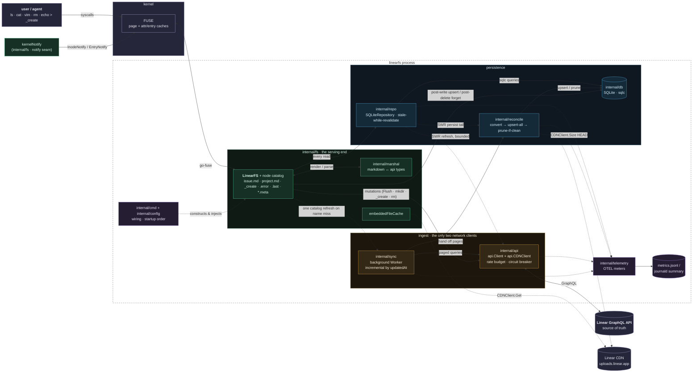

# LinearFS Architecture

LinearFS exposes Linear.app as a FUSE filesystem: issues, projects, initiatives,
and team metadata appear as a navigable directory tree of editable markdown files.
Editing a file's YAML frontmatter or body updates Linear; the filesystem is the UI,
the Linear API is the source of truth, and SQLite is a persistent cache in between.

This document maps the subsystems and, more importantly, **how they interact**.
For per-package internals see the source; this is the orientation map.

## System diagram


```mermaid
flowchart LR
    %% ===== external boundary: the human and the sources of truth =====
    USER["<b>user / agent</b><br/>ls · cat · vim · rm · echo &gt; _create"]
    LIN[("<b>Linear GraphQL API</b><br/>source of truth")]
    CDN[("Linear CDN<br/>uploads.linear.app")]

    subgraph KERNEL["kernel"]
        FUSE["FUSE<br/>page + attr/entry caches"]
    end
    KN["kernelNotify<br/>(internal/fs · notify seam)"]

    subgraph PROC["linearfs process"]
        direction LR

        subgraph FSP["internal/fs · the serving end"]
            direction TB
            LFS["<b>LinearFS</b> + node catalog<br/>issue.md · project.md · _create · .error · .last · *.meta"]
            MAR["internal/marshal<br/>markdown ↔ api types"]
            EFC["embeddedFileCache"]
        end

        subgraph DATA["persistence"]
            direction TB
            REPO["internal/repo<br/>SQLiteRepository · stale-while-revalidate"]
            RECON["internal/reconcile<br/>convert → upsert-all → prune-if-clean"]
            DB[("internal/db<br/>SQLite · sqlc")]
        end

        subgraph INGEST["ingest · the only two network clients"]
            direction TB
            WORKER["internal/sync<br/>background Worker<br/>incremental by updatedAt"]
            CLIENT["internal/api<br/>api.Client + api.CDNClient<br/>rate budget · circuit breaker"]
        end

        CMD["internal/cmd + internal/config<br/>wiring · startup order"]
        TEL["internal/telemetry<br/>OTEL meters"]
        METRICS[("metrics.jsonl /<br/>journald summary")]
    end

    %% ---- read path: user → kernel → fs → repo → SQLite (never the API) ----
    USER -->|syscalls| FUSE
    FUSE <-->|go-fuse| LFS
    LFS <-->|render / parse| MAR
    LFS -->|every read| REPO
    REPO -->|sqlc queries| DB

    %% ---- background ingest: worker → api → Linear, reconciled into SQLite ----
    WORKER -->|paged queries| CLIENT
    CLIENT <-->|GraphQL| LIN
    WORKER -->|hand off pages| RECON
    RECON -->|upsert / prune| DB
    REPO -.->|SWR refresh, bounded| CLIENT
    REPO -.->|SWR persist tail| RECON

    %% ---- write path: fs → api → Linear, then backfill SQLite + poke kernel ----
    LFS -->|"mutations (Flush · mkdir · _create · rm)"| CLIENT
    LFS -->|post-write upsert / post-delete forget| DB
    LFS -.->|one catalog refresh on name miss| WORKER
    KN -->|InodeNotify / EntryNotify| FUSE

    %% ---- lazy bytes: embedded files come from the CDN, not SQLite ----
    EFC -.->|CDNClient.Get| CDN
    RECON -.->|CDNClient.Size HEAD| CDN

    %% ---- cross-cutting: wiring in, telemetry out ----
    CMD -.->|constructs & injects| LFS
    CLIENT & WORKER & REPO & RECON -.-> TEL
    TEL --> METRICS

    %% ===================== lane styling =====================
    classDef ext     fill:#26263a,stroke:#9a9ac0,color:#e9e9f4
    classDef serve   fill:#173026,stroke:#54b98a,color:#d8f6e7
    classDef persist fill:#152a38,stroke:#4f9fd0,color:#d8eef8
    classDef ingest  fill:#332816,stroke:#cf9a4d,color:#f7ecd8
    classDef cross   fill:#251e33,stroke:#9376c8,color:#e9e0f8

    class USER,LIN,CDN,FUSE ext
    class LFS,MAR,KN,EFC serve
    class REPO,RECON,DB persist
    class WORKER,CLIENT ingest
    class CMD,TEL,METRICS cross

    style PROC fill:none,stroke:#666,stroke-dasharray:5 4
    style KERNEL fill:#26263a,stroke:#9a9ac0,color:#e9e9f4
    style FSP fill:#0f1a15,stroke:#356b52,color:#d8f6e7
    style DATA fill:#0f1720,stroke:#2f5f80,color:#d8eef8
    style INGEST fill:#1c160c,stroke:#7a5c2c,color:#f7ecd8
```

Reading the graph: it flows left→right along the **read path** (user → FUSE → fs
→ repo → SQLite, never the Linear API). The **serving** lane (green,
`internal/fs`) answers every read out of the **persistence** lane (blue, repo →
SQLite); the **ingest** lane (amber, worker → api.Client → Linear, reconciled
into SQLite) keeps that cache fresh in the background; and the **write path**
cuts straight from fs → api.Client → Linear, then backfills SQLite and punches
the kernel caches via `kernelNotify`. Solid arrows are the primary paths; dotted
arrows are background/lazy/cross-cutting (SWR refresh, CDN byte fetches, wiring,
telemetry). Note the one deliberate write-path → worker edge (stale-catalog
refresh) and that embedded-file bytes come from the CDN, not SQLite.

## The pipeline

The system is a one-directional read pipeline with a side-channel for writes:

```
                 reads (background, every ~2 min)
  Linear API ──> api.Client ──> Sync Worker ──> SQLite ──> Repository ──> LinearFS ──> FUSE ──> user
   (truth)                       (ingest)       (cache)     (read API)    (nodes)    (kernel)

                 writes (synchronous, on save / rm)
  user ──> FUSE ──> LinearFS commit tails ──> api.Client ──> Linear API
                          │                                      │
                          └── upsert / forget ──> SQLite <───────┘ (read-your-writes refetch)
```

Two rules govern the whole design:

1. **Reads never touch the Linear API.** Every metadata read is served from
   SQLite via the Repository, with no blocking cold-cache fetch: a read returns
   whatever SQLite holds and, when the surface it serves looks stale, kicks a
   **non-blocking** background refresh (stale-while-revalidate — sub-resources
   mostly, plus the team label catalog). The Sync Worker keeps SQLite fresh.
   Two deliberate exceptions block on the network: embedded
   attachment bytes (`*.png`, `*.pdf`) fall through memory → disk → a lazy CDN
   GET (`embeddedFileCache`), and a handful of interactive-tier synchronous
   reads (a few write-flow re-checks, e.g. the attachment-listing live
   re-check and the project read-your-writes re-fetch) — see `WithInteractive`
   under the rate budget.
2. **Writes go straight to the API, then backfill the cache.** The `api.Client`
   only talks to Linear — it never writes SQLite. The FUSE write handlers
   (`Flush`, `Mkdir`, `_create`, `rm`/`rmdir`) are responsible for upserting the
   result into — or, after a delete, forgetting the row from — SQLite and
   invalidating kernel caches so the next read sees fresh data. A committed edit
   also pushes its fresh entity **up** to the directory node that built the file
   (`adoptUp`), so the entity a later save diffs against tracks our own writes
   (#415) — which makes concurrent edits of one canonical `.md`
   last-writer-wins (see the `renameSave` note below).

This decoupling is deliberate: ingest (Sync Worker → SQLite) and serve
(SQLite → Repository → FUSE) are separate concerns, joined only by the database.
The upsert-then-prune tail lives in `internal/reconcile`, shared by the Sync
Worker and the Repository's SWR refreshes.

## Subsystems

### `internal/api` — Linear network clients (GraphQL + CDN)

The lowest layer and the only one that speaks to Linear over the network, through
exactly two clients: `api.Client` speaks the GraphQL API, and `api.CDNClient`
(`cdn.go`) speaks HTTP to Linear's uploads CDN for embedded-attachment bytes.
Both embedded-file consumers route through the one shared `CDNClient` — so CDN
traffic has one auth header, one timeout policy, and one set of OTEL instruments
(`linearfs.cdn.*`) instead of each wiring its own invisible `http.Client`:
`internal/fs`'s `embeddedFileCache` calls `CDNClient.Get` for bytes on read, and
`internal/reconcile`'s `Extractor` calls `CDNClient.Size` (a HEAD) for embedded-file
sizes during sync. Both transports are hardened: **each client refuses every
redirect** (`CheckRedirect` — `errCDNRedirect` and `errAPIRedirect`), because a
3xx is never legitimate (the uploads CDN serves attachment bytes directly; the
GraphQL endpoint is a pinned constant) and following one would only replay the
Authorization key onto the redirect target (SSRF / http-downgrade). The CDN
client additionally **caps each GET body at 100 MiB** (`maxCDNBytes`), erroring
rather than caching a truncated entry. The package's only internal dependency
is the small `internal/telemetry` instrument-constructor helpers. It exposes
~28 query methods (`GetTeamIssuesPage`,
`GetTeamMetadata`, `GetInitiativesProbe`, `GetIssueDetailsBatch`, …) backed by
31 named GraphQL operations — combined fetches like `GetTeamMetadata` issue
several (metadata query + drain-page twins), and a narrow method can reuse an
existing one (`GetTeamLabels` drains `queryTeamLabelsPage`, the same page query
the combined metadata fetch drains) — and ~30 mutation methods
(`UpdateIssue`, `CreateComment`, `CreateLabel`, …). Types in `types.go` mirror
Linear's schema; queries in `queries.go` are built from 17 shared GraphQL
fragments (`IssueFields`, `IssueFieldsLite`, `CommentFields`, …) concatenated as
Go string constants. Two fragment rules prevent silent drift:

- A combined query and its **drain-page twin** must project through the same
  fragment, or nodes past page one silently carry zero values.
- Every **mutation response** must project through the entity's fragment, not an
  inlined field list (the attachment mutations once drifted and dropped fields).

**Read-fetch envelope** (`fetch.go`, `paginate.go`): single-entity and
single-list reads decode through `fetchOne` / `fetchNodes` / `fetchConn` over a
shared `walkPath`. A null terminal is an **error** (not a silent zero value),
and `fetchNodes` trips loudly if a connection reports `hasNextPage` — paginated
reads must drain via `fetchAll`, which guards against stalled/repeating cursors
and caps runaway pagination. The combined metadata queries
(`GetTeamMetadata`, `GetWorkspace`) and the aliased `GetIssueDetailsBatch` share
that same `walkPath` descent — the combined queries decode their raw root and
lift each connection through `connAt` / `firstPageThenDrain` (first page +
`drain` tail), and the batch walks each alias — so a null parent object,
connection, or alias is an error, not a silent empty result a sync prune would
read as "everything was removed". Mutations use their own envelope (`exec.go`),
which gates on the `success` flag before decoding and then applies the same
null-terminal-is-an-error rule (shared `isJSONNull` predicate): a `success:true`
payload whose entity field is absent or explicitly null is an error, not a
silent zero-value entity.

Operational guards:

- **Rate budget** (`ratebudget.go`): dual-axis — request count *and* GraphQL
  complexity points — anchored to the server's
  `X-RateLimit-{Requests,Complexity}-{Limit,Remaining,Reset}` response headers
  (plus the per-query `X-Complexity` cost header) rather than hardcoded limits.
  The axes don't gate at all until the first response's headers seed them; only
  the 16-token micro-burst pacing limiter is pre-seeded (at a 2,500 req/hr
  rate) and re-sized at first contact. Operations are classed into priority
  tiers, each with a reserve fraction of budget it may not eat into: writes 0%
  (they always win), interactive 2%, up to bulk detail fetches at 40%.
  `api.WithInteractive(ctx)` promotes a user-blocking synchronous call to the
  interactive tier — the fs render closures thread the FUSE handler ctx for
  exactly this — with a documented never-store rule: a promoted ctx is minted at
  the moment of the call, never kept on a struct or handed to a goroutine.
  **This is the only admission governor.** No caller re-decides admission from
  its own threshold: the sync worker states intent (its ops' tiers) and reacts
  to the answer. The module has two entry points sharing one arithmetic —
  `admit` at send time, and `low()` as the preflight that refuses an expensive
  combined query or a multi-page drain *before* page one is burned and
  discarded. A second governor is not merely redundant, it is wrong: a
  threshold outside this module can only watch one axis, and the axis that
  empties in practice is complexity (measured live 2026-07-10: complexity 85%
  used while requests sat at 2–5%).
- **Circuit breaker** (`circuitbreaker.go`): after 5 consecutive network errors,
  opens for 30s to stop wasting budget during an outage, then lets one half-open
  probe through. A clock-injected state machine behind `allow()`/`recordFailure()`/
  `recordSuccess()` (the isolated sibling of the rate budget), driven in tests
  with a fake clock and no HTTP; `client.go`'s `query()` only calls it and logs
  the trip edge.
- **Metrics** (`metrics.go`, `cdn.go`): OTEL counters/histograms for per-op
  GraphQL requests, latency, complexity, and budget decisions
  (admit/defer/wait/ratelimited), plus per-method CDN requests and latency
  (`linearfs.cdn.*`).
- **Request log** (`requestlog.go`): optional JSONL trace of every completed
  request (op, vars, duration, outcome, complexity, and — on a failure — the
  first rejection, decoded: message plus
  `extensions.{code, type, userError, userPresentableMessage}`, beside the count
  of errors the response carried) to
  `~/.config/linearfs/requests.jsonl`, for offline diagnosis. The rejection's
  extension fields are written even when empty, because "Linear sent no code" is
  the observation a message-shaped predicate is waiting on;
  `userPresentableMessage` is among them because that is where Linear puts the
  cap/quota wording a census greps for, and the count is there because only the
  first rejection is decoded — the census that reads this artifact must be able
  to tell a lone rejection from the first of several without leaving it. Every
  string is capped at 2 KB with a truncation marker, since a non-GraphQL
  failure's message embeds the whole response body (#448).
- **GraphQL rejections** (`client.go`): a failed operation becomes a
  `*GraphQLError` carrying the FIRST error's message plus its decoded extensions
  (`code`, `type`, `userError`, `userPresentableMessage`). `Error()` renders only
  the message (callers string-match it), so the client logs `LogDetail()` — all
  five fields, empties included, each `%q`-quoted against log injection — at the
  one site that still holds them; a caller's `%v` would drop them. The size of
  the response's error array rides on the `*GraphQLError` itself (`ErrorCount`),
  so both sinks that record a rejection carry it — `errors=<n>` on this line and
  the `errors` key on the request log's — and a census can tell a lone untagged
  rejection from the first of several. `Client.query` is the
  single owner of that line, and the prefix carries the verdict: a rate-limited
  rejection keeps `[ratelimit] ERROR`, and a not-found one logs at a plain
  `[api]` prefix rather than `ERROR`, because a delete of an entity already gone
  is success and a 404 on refresh is the routine orphan signal (#448).
- **Error predicates** (`errors.go`): `IsRateLimited`, `IsNotFound`,
  `IsFieldTooLong`, `IsUsageLimited`, `IsDeferred` — the vocabulary the fs
  layer's error classifier maps to errnos. `IsUsageLimited` (the workspace is
  over a plan/usage limit) is likewise disjoint from `IsRateLimited`: a request
  budget clears when the window resets, so waiting is the fix, whereas no wait
  clears a plan wall — which is why it maps to `EDQUOT` rather than the
  retryable `EAGAIN` (#409). `IsNotFound` is disjoint from `IsRateLimited` for a
  sharper reason: a throttled rejection is not proof the entity is gone, and the
  delete tail reads not-found as idempotent success, so without that precedence a
  throttled delete forgets the local row for an entity Linear still has (#445).
  `IsNotFound` and `IsUsageLimited` are both anchored against Linear's own text —
  the phrase must CONSTITUTE the server's message, not merely appear inside it —
  because Linear echoes caller-supplied names back in its rejections (#445).
  `IsDeferred` (a local budget deferral: `ErrDeferred` or the
  pagination `ErrBudget`) is deliberately *excluded* from `IsRateLimited`: a
  server rate limit warrants a long pause until the window resets, but a local
  admission-ladder defer clears next cycle, so the sync worker skips-this-cycle
  on a defer instead of entering the hour-long rate-limit backoff (#257 — now
  structural: the worker holds no backoff of its own to enter).

**Consumed by:** Sync Worker (reads), Repository (SWR refreshes and its
reconcile pass), LinearFS (mutations plus the interactive-tier synchronous
reads), reconcile (entity types and page-size constants). Its types flow
everywhere.

### `internal/sync` — background ingest worker

The ingest side of the pipeline. `Worker` (`worker.go`) runs a goroutine on a
~2-minute ticker, started with the mount-lifetime context and stopped on
unmount. Before the first cycle it fires a **cold-start budget probe** — one
cheap `GetViewer` so real server headers seed both budget axes strictly before
expensive sync work; a rate-limited probe puts the worker to sleep until the
server-reported reset. Cycles come in two sizes:

- **Lean cycle** (the steady state): a cheap initiatives *probe*, per-team
  project probes, and per-team incremental issue sync. Skips the expensive
  workspace and team-metadata drains — this "sync-cycle diet" cut steady-state
  complexity spend by roughly an order of magnitude.
- **Full cycle** (every ~10 minutes): additionally re-syncs the workspace
  (users, initiatives with their project links, the project-label catalog) and
  full team metadata (states, labels, cycles, projects with milestones,
  members).

**Probes never license a prune**, so metadata deletions and link changes are
bounded by the full-cycle interval by design — with one carve-out: the label
catalog also refreshes (and prunes) on demand from the read path, because
label names and descriptions steer how agents file work and a 12-minute lie
was measured as harmful (#475). That bound is load-bearing for
one live-verified Linear quirk: linking/unlinking a project↔initiative bumps
*neither* entity's `updatedAt`, so link changes are structurally invisible to
the newest-first probes — the full-cycle workspace drain is the *only* thing
keeping links fresh, and cannot be "optimized away".

Scheduling is persisted in the **`sync_schedule`** key/value table: the
full-cycle cadence stamp, per-team probe watermarks, and the issue-ID-reconcile
stamp — all stamp-on-completion and restart-safe (a restart mid-window starts
lean; no full-cycle storm).

"Completion" for the full-cycle stamp is **deliberately asymmetric**: a cycle
whose workspace or team-metadata drain was refused by the admission ladder
(`api.IsDeferred`) does **not** stamp, so the full sync stays due and retries as
soon as the budget admits it. A drain that failed for any *other* reason
(network, GraphQL, one team's permissions) stamps as normal. The reason is
cost: a deferral is refused at the `LowBudget` preflight before the query is
paid for, so retrying every cycle is nearly free and the condition clears at the
window reset; a real failure pays full price per attempt, and withholding on it
would pin the worker in the expensive full mode for the duration of the outage.
The distinction is observable — `linearfs.sync.cycle_duration{mode=full,
outcome=complete|deferred|failed}`, where the per-series sample count is the
signal, since the histogram's default second-scale buckets cannot separate a
~0s deferred cycle from a healthy one.

This bound is load-bearing rather than cosmetic: prunes are licensed
exclusively by complete drains, so stamping a starved cycle would stretch the
metadata deletion/staleness bound by a whole full-cycle interval, silently.

The withheld stamp also keeps the worker in full mode for the rest of the
budget window, and full mode is what skips the change-detection probes — so a
deferred `syncTeamMetadata` **falls back to that team's `probeTeamProjects`**
(per drain, not per cycle). The probe does not go through the `LowBudget`
preflight, so it still admits at its ~1K cost in the band where a drain priced
at the preflight's default is refused, and it upserts what it fetches; without
the fallback a starved window would restore no projects data at all. A deferred
`syncWorkspace` gets no matching initiatives fallback: `probeInitiatives`
persists nothing itself and can only escalate to the `syncWorkspace` just
refused, so it would buy a change signal nothing can act on. A *failed* drain
gets no fallback either — it stamped, so the following cycles are lean and
probe anyway.

Each cycle, in order: drain the `pending_detail_sync` queue → workspace drain
(or, lean, the initiatives probe) → teams list → per-team (metadata drain, or
— lean/deferred — the projects probe, then issues) → the issue-ID
reconcile sweep when due (hourly, all-or-nothing per team, and mutually
exclusive with the repo's reactive reconcile via a CAS). Teams are synced in an
order **rotated by a per-cycle counter**, so mid-cycle budget deferrals rotate
across teams instead of permanently starving the last one — worst-case
staleness is bounded at `len(teams)` cycles.

- **Incremental strategy:** issues are fetched ordered by `updatedAt DESC` and
  pagination stops at the first page whose issues are all older than the
  `sync_meta.last_issue_updated_at` cursor.
- **Detail batching:** comments/docs/attachments/relations are fetched 10 issues
  at a time (`GetIssueDetailsBatch`); 15 exceeded Linear's 10k per-query
  complexity cap.
- **Rate-limit aware — by reacting, not by deciding:** the worker holds no
  budget thresholds and no rate-limit backoff of its own. Every fetch is
  admitted or refused by the rate budget's ladder at the moment of the call, on
  both axes and in priority order (detail fetches hold the largest reserve, so
  they stop first). A refusal arrives as `api.ErrDeferred`/`ErrBudget`, and the
  worker's job is what to do with it: detail batches go to the
  `pending_detail_sync` table and drain in later cycles, a refused
  skeleton-tier drain withholds the full-cycle stamp, and a refused team
  metadata drain degrades to that team's cheap projects probe (above).
  `syncDetails` returns a `detailOutcome` ledger (synced / deferred / gated) and stamps
  `detail_synced_at` only for issues whose details persisted cleanly. A server
  429 needs no worker-side pause either: the response snaps both budget axes to
  zero with a future reset, so `admit` refuses until the window refills.
- **Catch-up mode:** when a single team's incremental sync changes >50 issues,
  it relaxes the Repository's staleness threshold (5 min → 30 min) for the
  remainder of that team's sync, so on-demand refreshes don't duplicate work the
  worker is already doing.
- **Clock seam:** the worker's scheduling — cycle cadence, interval checks, the
  cold-start probe's wait — goes through injected `now` /
  `newTimer` / `newTicker` fields (`clock.go`); no bare `time.Now`/`time.Sleep`
  in the worker, so tests never sleep. (Persisted row timestamps use `db.Now()`,
  outside the seam — see `internal/db`.)

**Reads from** `api.Client`; **writes to** `db.Store` directly
(`store.Queries().Upsert*`) with `reconcile.Collection` as the prune-safe tail.
It does not go through the Repository for writes, and it performs **zero kernel
invalidation** — remote-change visibility is timeout-bounded (see cross-cutting
concerns). It also serves the write path's stale-catalog refreshes
(`RefreshTeamCatalogs` / `RefreshWorkspaceCatalogs` / `RefreshTeams` — see the fs
write flow; the teams list gets its own narrow refresh because the cycle, not
either catalog drain, is what syncs it).

### `internal/reconcile` — the shared upsert-then-prune tail

A small package owning the one algorithm both ingest paths share:
`Collection(spec)` upserts every fetched item and prunes local rows **only if
every upsert succeeded** (the "clean" guard) — a failed upsert must never
license deleting rows the fetch simply didn't cover. Callers decide whether
prune is licensed at all (nil `Prune` for capped/partial fetches).

- `PersistIssueDetails` applies it to the five per-issue detail collections
  (comments, docs, attachments, relations, inverse relations).
- `Extractor` parses Linear-CDN URLs out of markdown bodies and upserts
  embedded-file rows (the I/O tail of a pure, unit-tested parser), sizing each
  via the shared `api.CDNClient` (a HEAD).

**Called by:** the Sync Worker (workspace/metadata/details) and the
Repository's SWR refreshes (issue details; project/initiative docs, updates,
links; the team label catalog — the one repo-side reconcile that passes a
`Prune`, licensed by its drained fetch). The fs write tails do **not** go
through it — they upsert single entities directly, and the SWR refresh
reconciles behind them.

### `internal/db` — SQLite persistence (sqlc)

The cache and single source of truth for the running process. `schema.sql`
defines 26 tables; queries in `queries.sql` are compiled to type-safe Go by
**sqlc**. `convert.go` holds the bidirectional converters between `api.*` types
and DB rows.

Design conventions:
- **Hybrid storage:** queryable fields are extracted into indexed columns
  (`team_id`, `state_id`, `updated_at`, …) while the full API response is kept in
  a `data JSON` column. Avoids joins (names stored alongside IDs) and keeps the
  schema stable as Linear's API grows. Which of the two wins on read is the
  hydrate-then-overlay rule below. `teams.data` is the one NULLABLE `data`
  column: it was `ALTER`-added, so pre-existing rows have no blob, and NULL is
  read as *settings unknown* rather than as a team whose triage is off (the
  sentinel is `api.Team.IssueEstimationType`, which Linear types non-null). It
  also carries a `[]byte` override in `sqlc.yaml`, because the default
  `json.RawMessage` cannot scan a NULL.
- **`synced_at` everywhere** for staleness detection; issues additionally carry
  `detail_synced_at`, stamped only when a detail batch persisted cleanly.
- **Hierarchy edges are stored once,** as a `parent_id` column on the child
  (`issues.parent_id`, `teams.parent_id`, `project_labels.parent_id`). The
  inverse direction — a parent's children — is a query over that column, never
  a second stored copy, so the two directions cannot drift apart. New columns
  land last in `schema.sql` and get a bootstrap `ALTER` in `migrateSchema`, so
  a fresh and a migrated database agree — and an **index over such a column is
  created in `migrateSchema` too, never in `schema.sql`**, which runs first and
  would fail "no such column" on an upgraded database, tripping the
  drop-and-recreate fallback below and discarding the user's cache instead of
  migrating it (#432 tracks the missing guard).
- **Hydrate-then-overlay:** for entities with extracted columns (states,
  labels, users, cycles, teams, milestones, …), reverse converters unmarshal the
  `data` blob first, then overlay the columns — so no field is silently
  dropped, and a corrupt blob degrades to column-backed values instead of
  poisoning a listing. **The column is authoritative**: it is what the upserts
  maintain, so a blob written by an older build cannot resurrect a stale value,
  and a hierarchy edge is re-derived from its own column rather than adopted
  from the blob (`DBTeamToAPITeam` rebuilds `Parent` from `parent_id`, so a
  stale blob cannot become a second copy of the edge). Entities whose blob is
  the whole row (issues, projects, comments, …) pure-unmarshal and propagate a
  parse error instead.
- **Concurrency posture:** the Sync Worker and the FUSE write handlers write
  the same file concurrently. Safety rests on connection pragmas carried in the
  **DSN** — WAL journal mode, `busy_timeout(5000)`, foreign keys — so every
  pooled connection gets them (a `db.Exec("PRAGMA …")` configures only one
  pooled connection; that gap once caused deletes racing the worker to fail
  instantly and leave phantom rows).
- **Cancellation-detached queries:** the `Store` runs every SQLite operation
  through `ctxDetachDBTX`, a `DBTX` wrapper that strips the caller's context
  cancellation (keeping its values) before delegating. The callers are FUSE
  request handlers, and under load the kernel cancels a request's context — a
  spurious interrupt, not an abandoned op. That cancellation reaching SQLite
  makes the driver return `context.Canceled` regardless of `busy_timeout`,
  surfacing a clean local read as an EIO listing and a committed mutation's
  reflection as an EIO on close (the offline-suite flake, #296). A local read is
  sub-millisecond and a committed mutation MUST reflect, so neither hinges on the
  liveness of the request that triggered it; the worker still checks its own
  context between operations, so cooperative shutdown is unaffected.
- **No transaction wrapper:** multi-table writes are *not* transactional.
  Durability is `busy_timeout` plus single-statement upserts, with the
  reconcile clean-guard providing prune safety; a `Store.WithTx` helper was
  deleted after accruing zero production callers.
- **At-rest posture:** `cache.db` and its dir are owner-only (`0600`/`0700`).
  The SQLite driver creates the db file, so `Open` chmods it *after* open (the
  MkdirAll mode cannot reach it); the `-wal`/`-shm` sidecars are tightened
  alongside and otherwise live inside the `0700` dir. The mode constants and the
  best-effort self-heal chmod are shared with every other on-disk artifact via
  `internal/atrest` (see the threat model's TB3). This is one of three
  artifact-creating sites — the others are the embedded-file byte cache
  (`internal/fs/embeddedfilecache.go`) and the telemetry/request logs
  (`internal/telemetry/rotate.go`).
- **Time-format gotcha (read side):** the driver uses `_time_format=sqlite`, so
  timestamps come back space-separated, not RFC3339 `T`, and
  `time.Parse(time.RFC3339, …)` fails silently. Always use `ParseSQLiteTime` /
  `ParseSQLiteTimeAny` (`timeparse.go`).
- **Time-stamping invariant (write side):** SQLite orders timestamp TEXT
  lexicographically, and the driver binds a `time.Time` with its zone offset —
  a local-zone stamp misorders against UTC cutoff strings. Every `synced_at`
  write is supposed to go through `db.Now()` (UTC); reconcile's
  cutoff-before-fetch prune pattern depends on it (a local `time.Now()` seed
  once pruned fresh rows).
- **Migrations:** `migrateSchema` applies targeted, idempotent `ALTER TABLE`
  migrations (probe via `PRAGMA table_info`, add if missing); the blunt fallback
  — drop and recreate from the embedded schema on "no such column/table" — still
  exists because the DB is a disposable cache.

**Consumed by:** Sync Worker and reconcile (writes), Repository (reads),
LinearFS handlers (direct upserts/forgets after mutations).

### `internal/repo` — the read layer

The seam between storage and the filesystem: the concrete **`SQLiteRepository`**
(~48 exported methods across issues, comments, docs, labels, projects,
milestones, initiatives, relations, attachments, and the "my" views). A
`Repository` interface with an in-memory mock existed for the project's whole
life without a second consumer and was deliberately deleted — the header comment
in `sqlite.go` says to re-extract it mechanically if a real second adapter ever
appears.

- **`queryOne[R, T]`** (`queryone.go`) canonicalizes single-row getters:
  not-found → `(nil, nil)`, fetch errors labeled with the op, convert errors
  propagated.
- **Stale-while-revalidate** (`swr.go`): `maybeRefreshSWR` is the single owner
  of refresh policy — every refreshed surface routes through it with an
  `swrSpec` (staleness rule, refresh func, orphan classification). Refreshes are
  non-blocking, bounded by a 10-slot semaphore and a 30s timeout, and persist
  through the `reconcile` tails. Staleness is either TTL-based (5 min; 30 min
  in catch-up mode) or event-driven (`detail_synced_at` older than the entity's
  `updatedAt`).
  Most surfaces are entity sub-resources; the **team label catalog**
  (`GetTeamLabels`, TTL flavor) is the exception, and it is hooked on the
  repository read rather than on the FUSE directory node because
  `collectionDir.refresh` fires only on `Readdir` — reading one label file is a
  bare `Lookup`. Its refresh drains the whole catalog, so unlike the
  upsert-only doc/update refreshes it **prunes**: a label deleted in Linear can
  leave the cache between full sync cycles. Without it, labels reached SQLite
  only on the full cycle, so a remote label edit was invisible for
  `FullSyncInterval + Interval` — ~12 min, measured (#475).
  Its freshness is a **per-team stamp** in `sync_schedule`
  (`db.TeamLabelsScheduleKey`), not an aggregate over the label rows: the rows
  are shared (a team's catalog is its own labels plus the workspace ones), so a
  row-derived signal lets one team's refresh declare every other team fresh,
  and a legitimately empty catalog has no row to stamp at all — the permanent
  per-browse refetch loop `detail_synced_at` exists to avoid. The refresh
  stamps the key on a clean pass (a zero-label fetch included); **the sync
  worker's `syncTeamMetadata` stamps the same key**, so a read moments after a
  full cycle does not re-drain what the cycle just persisted. It is the one
  schedule key written by both packages, which is why the factory lives in
  `internal/db` — `internal/sync` and `internal/repo` do not import each other.
- **Orphan handling:** a refresh that hits Linear's "Entity not found"
  cascade-deletes the local rows (issue → its comments/docs/attachments/
  relations/history; likewise projects and initiatives) and schedules a
  reconciliation pass (rate-limited to every ~6h) that diffs local IDs against
  the authoritative API sets. The worker's hourly scheduled issue-ID sweep is
  the proactive twin, CAS-excluded from running concurrently with it.

**Reads from** `db.Store`; uses `api.Client` only in the background — SWR
refreshes and the orphan-triggered reconcile pass — a read call itself never
blocks on the network. **Consumed by:** LinearFS for every read.

### `internal/marshal` — markdown ↔ Linear translation

The format boundary. Converts `api.*` objects to markdown (YAML frontmatter +
body) for display, and parses edited markdown back into partial updates —
changed-field maps for issues/documents/labels, a typed diff input for
milestones, and extraction-only structs for projects/initiatives
(`ProjectEdit`/`InitiativeEdit` — the fs edit modules own that diffing).
Parsing is `yaml.v3` end to end (the hand-rolled frontmatter scanner is gone),
and malformed input — e.g. unclosed frontmatter — is rejected loudly rather
than silently treated as body text.

- Symmetric pairs: `IssueToMarkdown` ↔ `MarkdownToIssueUpdate`, plus document,
  milestone, label, project, and initiative variants; history is render-only
  (`history.md` is read-only). `Render` builds frontmatter documents for the
  generated catalog files too.
- **Declarative issue fields:** the editable scalar issue fields (title, team,
  status, assignee, due, parent, project, milestone, cycle) are defined once in
  the `issueScalarFields` table; render, diff-update, and create each iterate it
  rather than hand-coding the field per path, so adding a field is a one-row
  change and the render/parse/mapping paths cannot drift. Priority, estimate, and
  labels keep bespoke coercion (they are not homogeneous scalars).
- **Closed key set:** issue.md's accepted keys are exactly that table plus the
  three bespoke fields, and a document naming anything else is rejected whole as
  a `FieldError` — a key is applied or reported, never accepted and dropped
  (#426). The accepted-key list is derived from the table, so a new editable
  field is admitted by the guard without a second edit. The keys `issue.meta`
  renders are recognized rather than unknown: an update reports them as
  read-only and names the sidecar; a create ignores them, so a spec assembled
  from a rendered issue plus its meta still creates.
- **Partial updates:** `MarkdownToIssueUpdate` diffs against the original and
  returns only changed fields.
- **Field clearing:** a deleted frontmatter line becomes an explicit `nil`/`[]`
  in the update map (e.g. removing `assignee:` clears the assignee).
- **Placeholder round-trip** (`placeholder.go`): an empty entity renders as
  `placeholderBody(title)`, and `isPlaceholderNoop` guards the reverse trip —
  a read-then-save of an empty document never pushes the fabricated heading to
  Linear as real content. Render and guard are defined together so they can't
  drift.
- **`FieldError`** lives here: a structured field/value/reason error the fs
  layer maps to errno + `.error` content (fs re-exports an alias).
- **ID resolution is deferred:** frontmatter holds human-friendly values
  (assignee *email*, label *names*, project *name*); marshal leaves them as-is
  and the fs layer resolves them to Linear IDs before calling the API. Helpers
  like `ScalarToString` / `StringSliceFromYAML` canonicalize YAML scalars.

**Consumed by** `internal/fs` only. Depends on `yaml.v3` and `api` types.

### `internal/fs` — the FUSE filesystem (the core, ~65 non-test files)

The serving end and the largest package, built on `go-fuse/v2`. The root struct
`LinearFS` (`linearfs.go`) is sectioned:

- **API seam:** the `api.Client` plus injectable interfaces —
  `MutationClient` (`mutationclient.go`, every mutation; swappable in tests via
  `testutil/mockmutation`), a `verifyReader` for read-your-writes refetches, a
  `liveReader` for the authoritative-live-list reads the mutation tails need (the
  links create phantom check and the attachment re-check), and a catalog-refresher
  seam for the stale-catalog flow below. All are auto-detected off the injected
  fake in `InjectTestMutationClient`, so one swap wires whichever seams the fake
  implements; the concrete `api.Client` satisfies all of them, leaving production
  wiring unchanged.
- **Persistence:** `SQLiteRepository` (every metadata read, including
  `teams/{KEY}/docs/`, which is served from SQLite with a stale-while-revalidate
  background refresh like the project/initiative doc surfaces), `db.Store`, the
  `sync.Worker`, and the mount-lifetime `lifeCtx`/`spawn` pair that ties every
  background goroutine to unmount.
- **Sub-modules (embedded structs):** `writeFeedback` (the `.error` *and*
  `.last` state), `embeddedFileCache` (memory → disk → CDN bytes for embedded
  files), and `kernelNotify` (the only coupling to `*fuse.Server`).

Rather than one node type per path, most surfaces compose a small set of
building blocks:

- `renderFile` — any read-only generated file (`.meta` sidecars, `states.md`,
  `history.md`, the mount README). Serves with `FOPEN_DIRECT_IO`: generated
  content renders on every read and can never go stale behind the kernel page
  cache.
- `symlinkNode` — the one module behind every symlink view: `by/status|label|
  assignee`, `cycles/` (+ the `current` alias), `recent/`, `users/`, `my/`,
  `children/`, the team hierarchy (`teams/{KEY}/parent` and `subteams/`),
  project issue symlinks, and initiative→project links. Target and
  times are fixed at construction (a Lookup answer and a later Getattr can never
  disagree); an unresolvable target is `ENOENT` at Lookup, never a dangling
  placeholder.
- `dirManifest` + `attrNode` — static directory children and attrs.
- The **listing family** — `namedListing`, `indexedListing`,
  `attachmentListing`, `relationListing`, `linkListing`: each directory's
  `Readdir` entries and `Lookup` are pure projections of one source, so any
  name you can `ls` you can also open and `rm`. The collision policies are
  deliberate and split: dedup (`foo (2).link`) is licensed only where the
  filename is *not* a resolution key (attachments, links); where it is (labels/
  milestones resolve by name, `.rel` names feed `rm`), collisions shadow
  first-match/emit-once — a suffixed name would resolve nowhere.
- `safeName(raw, id)` (`safename.go`) — the single name/target **safety
  chokepoint**. Every name/target builder (the `*DirName`/`*Filename` family,
  `sanitizeFilename`, the `by/` value names, and every symlink-target component)
  routes its cosmetically-transformed output through it: `/`\`, NUL, and C0
  controls become `-`, trailing spaces/dots are trimmed, an empty/`.`/`..` result
  falls back to the entity id, and an exact collision with a reserved control
  literal (`_create`/`.error`/`.last`/`.meta`/`current`/`unassigned`) is escaped
  with `-<id>`. It unifies the safety *invariant*, not cosmetic style (each
  builder keeps its own casing), and is a non-breaking pass — only pathological
  names change. A CI grep-rule (`scripts/check-safename.sh`) guards against a new
  builder bypassing it. This is the TB1 name/target defense in the threat model.
- `editBuffer` — the read/write buffer under every editable file, and
  `collectionTrio` + `createFileNode` — the writable-collection kit: the trio
  guarantees every writable directory serves `_create`/`.error`/`.last`
  uniformly, and `_create` uses a per-open file handle so each
  open-write-close cycle creates exactly one item. `collectionDir` sits above
  them, owning the item-file surface (Readdir/Lookup/Unlink/Create) the four
  dynamic collections share — including the classification a name gets there: an
  item `.md`, its read-only `.meta` shadow, a trio surface, or an editor's
  scratch temp file (see the write flow).
- `ino(kind, id)` — one FNV-based inode namespace, stable across remounts.
- `nodeRefresher` — a re-looked-up node re-reads fresh entity data (go-fuse
  keeps the first node per inode), with a load-bearing conflict rule: **a dirty
  edit buffer always wins** — a user's in-flight edit is never clobbered by
  background sync, and Lookup reports the kept node's size so a fresh twin
  can't truncate kernel reads of longer dirty content. A **just-authored** buffer
  wins the same way (serve-your-own-writes, #365): after a write commits cleanly
  (`errno == 0`), `editFlush` marks the buffer authored, and `refresh` keeps the
  exact written bytes while the flag stands — so a client that verifies a
  write by re-reading gets a byte-for-byte match instead of racing the async
  refresh, while persistence (SQLite and the entity) already holds Linear's
  normalized render. A fresh `Open` clears the flag on that node but does not
  end the window: a rebuild inside the pin's TTL (below) re-arms it from the
  pin, which is the real outer bound (#388). It is not armed on a fatal
  read-your-writes divergence (a revert or truncation, EIO), so a real loss is
  never masked from a re-read.
- `authoredPins` — the same guarantee for the written *bytes* rather than the
  buffer, so it survives the node the flag dies with (#379, #381). Two paths need
  that: the **atomic-save** path flushes through a transient node and then drops
  the canonical file's inode on purpose, so the re-Lookup would render what
  persisted; and on either path a dentry forget rebuilds the node with an empty
  buffer and no flag. `editFlush` pins the bytes under the file's `pinIno` on
  exactly the condition that arms `authored` — a committed write with
  `errno == 0`, so neither a fatal divergence nor a save that changed nothing is
  echoed back as a byte-for-byte success — and a Lookup seeds the new buffer,
  content *and* the size it publishes, from the pin instead of the render.
  **One pin site is load-bearing**: a pin is superseded by the next write to the
  same inode, so arming it in `editFlush` rather than in `renameSave` is what
  keeps a later in-place edit from leaving older atomic-save bytes pinned (#381).
  **Both halves are single-sited**, which is what keeps them wired together:
  `editFlush` is the only place a pin is armed, and `newFileInode` — the one
  builder every editable file node passes through — is the only place one is
  consumed, recognising an editable child by the `editable()` accessor
  `editBuffer` provides (#387). Before that the consuming half was hand-written
  per file, so `pinIno` was set only for `issue.md`, `project.md`, and
  `initiative.md`, and a comment/doc/label/milestone `.md` had neither half: its
  written bytes survived only as long as the node did. All seven set it now;
  zero still means no pin, correct only for a file nothing builds through that
  path. Bounded by time (`pinTTL`), not by one Lookup: a
  client's verification is several syscalls, each able to drive its own Lookup, so
  all of them must answer alike. Without it a server-side reformat that changed the
  byte count reached the client as a size mismatch, which editors report as a
  possibly truncated write on a save that fully succeeded.
- `resolveByName` — collapses the regular single-name→ID resolvers
  (state, project, milestone, cycle, initiative, and team — which tries the key
  first, then the name, since the key is what renders); user, issue-identifier,
  label, and project-slug resolution remain bespoke.
- **A team move is the one edit that relocates its own file.** `team:` is an
  editable `issue.md` field (#429), and Linear re-numbers a moved issue into the
  destination team's sequence — so the path the write was made through ceases to
  exist. That is why `editFlushSpec` carries an `invalidateExtra` hook alongside
  the static `coherence` inode list: which directories and which entry NAMES go
  stale is knowable only from what the mutation returned (old team's
  `issues/`+`recent/` under the old identifier, new team's under the new one).
  Every other edit is fully described by the inode list.

**Read flow:** kernel → `Lookup`/`Readdir`/`Read` → Repository → SQLite →
marshal to markdown bytes. `mtime` = `updatedAt`, `ctime` = `createdAt`.

**Write flow (the important interaction).** Four sibling commit tails own the
write directions: `commitCreate` (`createcommit.go`), `commitWriteBack`
(`editcommit.go`), `commitDelete` (`deletecommit.go`), and `commitRename`
(`renamecommit.go`) — the entity-rename tail that mutates then confirms local
reflection through the persist gate (`persistOrEIO`) and re-cohers the
`.md`/`.meta` pair; it carries no read-your-writes compare (that verification is
a layer above the commit-tail primitives) and no telemetry (matching
`renameSave`). For an edit:
1. `Write` buffers bytes in the `editBuffer`; `Flush` parses the markdown via
   `marshal`. Editor save-via-rename (temp file + `rename`) is caught by a
   scratch node and routed through the same path (`atomicwrite.go`,
   `renamesave.go`); the flush itself pins the written bytes for the re-Lookup
   that path forces (`authoredPins`, armed in `editFlush`). **Every directory
   holding an editable `.md` accepts that dance** — the three entity directories
   and the four dynamic collections — because no editor and neither Claude Code
   tool writes in place; a directory that rejects the temp-file create fails a
   save at its first syscall, before any of the failure model below is reachable
   (#145, #438). `renameSave` owns the tail (EXDEV → scratch lookup → resolve →
   flush → adopt-on-`{0,EIO}` → consume → invalidate) and delegates only *where a
   save may land*: `onlyFileTarget` for an entity directory's one writable file,
   `collectionDir.itemFileTarget` for a collection, where an existing `{name}.md`
   is a replace and a new one is a create — the same two outcomes, through the
   same closures, that the directory's named `Create` has. The entity-directory
   resolver builds its transient file node from the **directory node's own
   entity**, which is therefore the *save baseline* — what every `Flush` diffs
   the written document against to decide what to send. That is deliberate and
   load-bearing: an absent frontmatter key means *clear this field*, so a
   baseline fresher than the entity the document was rendered from clears every
   field the writer never saw. Render and baseline must be one entity; what keeps
   that entity current is the write path pushing to it (`adoptUp`,
   `adoptup.go`), not the read path reaching around it. Before that, an in-place
   save left the directory's copy stale and a later atomic save restoring what it
   replaced read as no change — no mutation, success returned, write lost
   (#415). The consequence to know: "saving back what you read is a no-op" holds
   only while nothing else writes in between. Two writers are
   **last-writer-wins** — a save diffed against an entity another writer just
   adopted up clears the fields its own document has no key for. That is the
   deliberate trade against the silently dropped write above.
2. The fs layer **resolves names to IDs** (team key→teamId, status→stateId,
   assignee email→userId, labels→labelIds, project/milestone/cycle/parent→IDs).
   **Ordering is load-bearing** in `resolveIssueUpdate`: `team` resolves FIRST,
   because every other issue resolver is team-scoped and one edit may both move
   the issue and change a scoped field — those names must resolve against the
   DESTINATION team, or a same-named state in the source team resolves to an ID
   the issue no longer has any relation to (#429). `project` before `milestone`
   is the same rule one level down. A local catalog miss self-heals: a typed
   unknown-name error triggers exactly **one** targeted catalog refresh — routed
   through the Sync Worker's `RefreshTeamCatalogs`/`RefreshWorkspaceCatalogs`/
   `RefreshTeams` so budget gates and prune licenses come free — then one retry
   before the write fails. This is the only place the write path drives the
   worker. Edits decompose into shared halves: `scalarEdit` (name/body),
   `labelsEdit`, `reconcileLinks` (initiative/project links).
3. On valid input, calls the `MutationClient`. `classifyMutationErr`
   (`createcommit.go`) is the single owner of the failure model: bad input →
   `EINVAL`, over-length field → `EMSGSIZE`, missing reference → `ENOENT`,
   rate-limit/timeout/interruption → `EAGAIN`, workspace over its plan limit →
   `EDQUOT`, backend failure → `EIO` — reason always written to `.error`. Arm
   ORDER is load-bearing in two directions: the arms keyed on a condition Linear
   does not reliably tag (`ENOENT`, `EDQUOT`, `EMSGSIZE`) sit ABOVE the
   `userError` gate, so their errno does not depend on a server-set bit (#409);
   and those same arms, which answer on message TEXT, sit BELOW the arms that
   answer on error STRUCTURE (`*notFoundError`, `*FieldError`,
   `retryableCreateErr`), because the text can be the caller's own echoed input
   or a throttle's envelope. Missing reference covers both the fs-local
   `notFoundError` and Linear's own "Entity not found" (`api.IsNotFound`, #445);
   only the delete tail's *mutate* step reads that rejection differently, as
   idempotent success — a delete whose *find* fails that way classifies here
   like any other tail. The `EAGAIN` branch splits its *message* on
   `api.IsOutcomeUnknown`: a request refused before it was sent (budget
   deferral, cancelled pre-send wait, tripped breaker) provably had no effect,
   while one whose POST was already on the wire (`api.ErrInFlight`, set in the
   client's transport-error path) may have been applied with the response lost,
   so its `.error` tells the caller to CHECK before retrying rather than
   promising a no-op (#399).
4. **Read-your-writes** (`editcommit.go`): re-derives what persisted — an
   independent refetch where a single-entity getter exists (issues, projects,
   initiatives), otherwise the mutation's echoed response — normalizes benign
   markdown reformatting, and flags a silent revert/truncation as `EIO`. A
   `writeBackResult` may override that errno where retrying is known to be
   futile; the one case is a project/initiative body-clear Linear declines to
   apply, which is `EINVAL` (#398). The verdict is derived from what actually
   persisted, not from a hardcoded belief about the backend, so a backend that
   does apply it simply succeeds. A retryable divergence in the same save
   outranks the override — telling a caller not to retry a write a retry would
   fix is the worse error — so mixed outcomes still surface `EIO`, with both
   messages in `.error`.
5. **Upserts the fresh result into SQLite** via the tail's per-spec persist
   closure (direct single-entity upserts; the `reconcile` tails belong to the
   worker and SWR, not this flow). This upsert **gates success** across every
   write tail: a mutation Linear accepted but that cannot be reflected locally is
   retried against the `SQLITE_BUSY`/sync-worker race (`retrySQLite`,
   `persistgate.go`) and, on exhaustion — a wedge — fails loud (`EIO`) with a
   `.error` naming the **safe recovery** rather than reporting a clean save over a
   diverged view (#276/#278). The recovery differs by direction: a **create** is
   NOT retryable (a blind retry duplicates the already-created item), so its
   `.error` names the entity and says "do not recreate"; an **edit/rename/delete**
   is idempotent, so its `.error` says re-issuing is safe (a delete adds "re-run
   `rm` to clear the phantom"). It then re-cohers the kernel through the
   intent-named `kernelNotify` policy methods — `InvalidateCreated` /
   `InvalidateUpdated` / `InvalidateDeleted` / `InvalidateRenamed`. Handlers
   never hand-pick the raw `InodeNotify`/`EntryNotify` primitives; hand-picked
   combinations drifted (missed dir inodes, un-notified unlinks) before the
   policy module existed. Each intent runs its notify sequence under a 5s
   deadline (`boundedNotify`): the raw primitives do not honor a context and can
   wedge, so on the deadline the stuck goroutine is leaked and control returns to
   the handler — a wedged notify degrades to "handler completes, that dir's cache
   is briefly stale" plus a `linearfs.fuse.notify_timeouts` count, instead of
   hanging the write until a manual restart (#277).

**Delete flow:** `rm` of a comment/doc/label/relation/… or `rmdir`-archive of
an issue/project goes through `commitDelete`: API delete first, then a
**required** SQLite forget (retried on `SQLITE_BUSY` via the same `retrySQLite`
gate — the store is the listing source of truth, so a skipped forget resurrects
the item as a phantom). On forget exhaustion it fails loud (`EIO`, `.error`
naming the self-heal) and skips `InvalidateDeleted` (the phantom row is still
present); otherwise `InvalidateDeleted` runs. "Entity not found" from the delete
tail's *mutate* step is idempotent success, so re-`rm`ing a phantom row heals it;
the same rejection from its *find* step is not behind that gate and classifies
like any other tail (`ENOENT`).

**Deliberately-swallowed errors carry a one-line intent note.** A best-effort
write that is *meant* to be swallowed (a startup optimization, a fetch cache, a
scheduling ledger, a verification re-read of a write that already landed) carries
an `// intentionally best-effort: <why> (recovers via <path>)` comment, so a
future audit distinguishes an audited swallow from a load-bearing one it must
harden. The load-bearing reflections all commit through the `persistgate.go`
gate above.

**Special filesystem semantics:**
- **`_create` trigger files** (write-only, mode 0200): reads are rejected with
  `EACCES`; a write creates an item (issue, comment, doc, label, attachment,
  relation, update, …). Read-before-write editors can't use them — pipe content
  instead.
- **`.error` / `.last` sidecars** (read-only, backed by `writeFeedback`): every
  writable surface exposes the last failure's reason in `.error` (cleared on
  success) and, where the surface mints an entity, a per-create outcome log in
  `.last` — the created identity/URL on success, an `outcome: failed` entry on a
  clean create failure — so a scripted batch reads back how many of N creates
  succeeded and scripts and LLMs never have to parse an errno. The one exception
  is the persist-failure branch (#276): a create Linear accepted but that we
  cannot cache locally is *not* logged to `.last` (as success or failure), since
  the entity is live — it fails loud in `.error` instead.
- **`.meta` sidecars:** editable files hold *only* editable fields; the
  server-managed fields (id, url, timestamps, …) render into a read-only
  `<name>.meta` twin. Editing a server field is impossible by construction.
- **Project labels** (`projectlabels.go`): `labels:` in `project.md` validates
  against the workspace-wide `project_labels` catalog (synced in the full
  cycle; browsable at the mount root as `project-labels.md`). Unknown IDs
  render verbatim and pass through the resolver, so a stale catalog can never
  strip labels on an untouched save; group/retired enforcement is deliberate
  policy that is *stricter* than the API (the server accepts retired-label
  assignment; LinearFS rejects it).
- **Generated README:** the mount root's `README.md` is generated at runtime by
  `generateReadme` (`root.go`) and is the primary doc agents read. Any change to
  a filesystem surface or contract must update it in the same change;
  `TestGeneratedReadmeMatchesBehavior` guards against drift. It has one
  conditional section: with `cfg.UserFeedback` set (env `USER_FEEDBACK`, plumbed
  to `lfs.userFeedback`), a static const carrying the agent self-reporting
  protocol is *appended* — the flag-off render is byte-identical to the plain
  README, which is what makes the opt-in free.

**Consumed by** `internal/cmd` (which mounts it).

### `internal/telemetry` — OTEL metrics pipeline

Owns the meter provider the recording packages (api, sync, repo, reconcile,
fs) record into. `internal/fs` records serving-layer instruments (`metrics.go`,
meter `linearfs/fuse`): `linearfs.fuse.ops {op, outcome}` and
`linearfs.fuse.duration {op}` at the four commit tails (create/delete/flush/rename)
and the editBuffer/renderFile read/write entry points, plus
`linearfs.embedded_files.fetch {source=memory|disk|cdn}` at the byte-cache
tiers. Coverage is those cheap choke points, not lookup/readdir (spread across
every node type with no shared tail). It also wires the optional per-request
debug log. One `MeterProvider`, two renderings: an always-on 5-minute summary line to
journald/logs, and a config-gated file export writing one compact JSON line per
interval to `~/.config/linearfs/metrics.jsonl` through a rotating writer
(diagnosis = `jq` over that file). There is no OTLP exporter. Exporter failure
degrades to summary-only — telemetry must never take the mount down.

### `internal/cmd` + `cmd/linearfs` + `internal/config` — wiring

`cmd/linearfs/main.go` calls `cmd.Execute()` (Cobra). Commands: `mount` (with
`--foreground`/`-f`), `status` (read-only local health snapshot; never talks to
the daemon) and `version`; `--config`/`-c` and `--debug`/`-d` are root
persistent flags. **Startup order** (`mount.go` → `linearfs.go`):

1. `config.Load()` — reads `LINEAR_API_KEY` and `USER_FEEDBACK` (env overrides
   file) and `~/.config/linearfs/config.yaml` (or `$XDG_CONFIG_HOME`); loading
   itself succeeds without a key. `--config` names an exact file instead
   (`config.LoadFrom`) — unreadable is fatal for `mount`, while `status` falls
   back to defaults. One hard refusal: if the key's source is the config file
   (not the env escape hatch) and the file is group/other-accessible
   (`mode & 0o077 != 0`), load fails and names the fix (`chmod 600`) — see the
   threat model's TB3.
2. `fs.PreflightMountpoint(...)` — detects and heals a wedged/stale FUSE mount
   at the target before mounting over it.
3. `telemetry.Init(...)` — metrics pipeline up before anything records.
4. `fs.NewLinearFS(cfg, debug)` — enforces the API key (errors if unset), then
   builds the `api.Client`; repo/store still nil.
5. `lfs.EnableSQLiteCache("")` — opens the cache DB (default via
   `db.DefaultDBPath()`: `os.UserConfigDir()/linearfs/cache.db` — deliberately
   *outside* the mountpoint), builds `SQLiteRepository`, loads the cached
   viewer into it, spawns a background viewer refresh, and starts the
   `sync.Worker` under `lifeCtx`.
6. `fs.MountFS(...)` — creates the root node, mounts via go-fuse (attr/entry
   timeouts 60s/30s, overridable with `WithKernelCacheTimeouts` — a negative
   override is clamped back to its default, since the kernel reads both bounds
   unsigned), publishes the resolved entry timeout on `LinearFS` so the per-node
   build sites hand the kernel the mount's own policy rather than a literal of
   their own (#414/#449).
   Every node's bound goes through the single `applyNodeTimeout` helper and is a
   named policy, never an inline duration — guarded by
   `TestNoHardcodedKernelTimeouts` and `TestTimeoutSettersGoThroughOneChokePoint`.
   Then hands the server ref to `kernelNotify`.
7. On SIGINT/SIGTERM: unmount; after `server.Wait()` returns, flush telemetry
   *first* (the final export's observable gauges read the still-open store),
   then `lfs.Close()` — cancel `lifeCtx`, wait for spawned goroutines, stop the
   worker, close repo, store, and request log.

`internal/config` defines the config struct and load logic (including the
telemetry file/requests sections). `internal/testutil` provides test fixtures
and `mockmutation`, the in-memory fake behind the `MutationClient` seam.

## How the pieces fit together (interaction summary)

| Interaction | Direction | Mechanism |
|---|---|---|
| Sync Worker ← Linear | read | `api.Client` queries, lean/full cycles, incremental by `updatedAt` |
| Sync Worker → SQLite | write | `store.Queries().Upsert*` + `reconcile.Collection` tail (not via repo) |
| Sync Worker → kernel | *nothing* | deliberate: no invalidation from ingest; remote-change freshness is timeout-bounded (60s/30s) + `nodeRefresher` on re-Lookup |
| Repository ← SQLite | read | sqlc queries + hydrate-then-overlay converters → `api.*` types |
| Repository → Linear | background | SWR refreshes via `maybeRefreshSWR`, semaphore-bounded, never blocking; persists via `reconcile` |
| LinearFS ← Repository | read | ~48 concrete methods, every FUSE read |
| LinearFS ↔ marshal | both | `api.*` ↔ markdown; fs resolves names→IDs |
| LinearFS → Linear | write | `MutationClient` mutations on `Flush`/`_create`/`Mkdir`/`rm` (+ a few interactive-tier reads) |
| LinearFS → SQLite | write | commit tails upsert fresh results / forget deleted rows directly (`store.Queries()`) |
| LinearFS → Sync Worker | write path | one targeted catalog refresh on a local name miss, then one retry |
| LinearFS → kernel | invalidate | `kernelNotify` intent methods: `InvalidateCreated`/`Updated`/`Deleted`/`Renamed` |
| api/sync/repo/reconcile → telemetry | record | OTEL instruments → summary log + config-gated `metrics.jsonl` |
| cmd → everything | wiring | constructs and injects in startup order |

## Cross-cutting concerns

- **Caching is layered:** kernel page/attr cache → go-fuse node cache → SQLite.
  Writes must punch through the kernel layer explicitly (the `kernelNotify`
  intent methods), and re-looked-up nodes re-read entity data via the
  `nodeRefresher` seam — with the dirty-buffer-wins rule where user edits and
  background sync meet in one inode. Generated files opt out entirely: they
  render on every read (`FOPEN_DIRECT_IO`). The ingest side never invalidates;
  remote edits become visible when the 60s/30s kernel timeouts expire.
- **Rate budget is the scarce resource, and it has exactly one governor:**
  admission is `ratebudget.admit`'s decision alone — dual-axis, tiered, with
  reserve floors — reached through `admit` at send time or the `low()`
  preflight before an expensive drain. Everything else shapes *demand* rather
  than deciding admission: the worker's lean cycles, cold-start probe, team
  rotation, and detail batching reduce what is asked for; the pending-detail
  queue, the withheld full-cycle stamp, and the projects-probe fallback that
  stamp triggers are what it does with a refusal.
  Writes always win; user-blocking reads jump the ladder via `WithInteractive`.
  A caller that re-derives its own threshold is a bug, not a safety net: it can
  only see one axis, and requests is not the axis that empties.
- **Staleness coordination:** `synced_at` + `detail_synced_at` columns, the SWR
  coordinator, the worker's incremental cursor + persisted `sync_schedule`
  watermarks, and catch-up mode all coordinate so the worker and on-demand
  refreshes don't duplicate work. Probes never prune, so deletions and
  link-changes are full-cycle-bounded.
- **Error surfacing contract:** every writable surface has a `.error` sibling
  (and `.last` where entities are minted). Bad input → `EINVAL`, over-length →
  `EMSGSIZE`, missing reference → `ENOENT`, rate-limited/timeout/interrupted →
  `EAGAIN`, workspace over its plan limit → `EDQUOT`, backend failure → `EIO`;
  the reason always lands in `.error`,
  cleared on success. A stale local catalog self-heals with one refresh-and-retry
  before any of that surfaces. Three refinements the errno alone cannot carry, so
  the `.error` text is load-bearing: an `EAGAIN` says whether the request was
  refused before it was sent (safe to retry blindly) or interrupted in flight
  (outcome unknown — check first, or duplicate); an `EIO` from the
  read-your-writes check means retry, so the one divergence that retrying can
  never fix — a declined body-clear — is `EINVAL` instead (#398/#399); and the
  two arms whose failure retrying cannot fix, `EDQUOT` and a Linear-side
  not-found `ENOENT`, both have to SAY so, since no errno carries that
  next-action. They share the phrasing and differ in why it is futile: `EDQUOT`
  is a capacity wall that clears once the workspace has room (archive, delete, or
  raise the plan limit, then retry), while the `ENOENT` reference is gone for
  good, so the only action left is to drop or repoint the reference. The text
  names no reconciling read, deliberately: the failed write prunes nothing, and
  the reads an agent reaches for first do not prune either (`issue.md` renders
  from the dir manifest's captured value, `issue.meta` is a plain
  `GetIssueByIdentifier`). Sibling reads that *do* — `history.md` and the
  `comments/`/`docs/`/`attachments/` listings route through orphan-carrying SWR
  specs (`historySpec` and `MaybeRefreshIssueDetails`, both classifying to
  `deleteOrphanIssue`) — prune as a background side effect, which is not a
  recovery step to hand an agent, so the `.error` promises only that the
  cache-served listing can keep showing the entity until a sync cycle or the
  worker's reconcile sweep (`reconcileIssuesForTeam` → `deleteOrphanIssue`)
  removes it (#409/#445).
- **Empty and zero-filled writes are refused at the shell:** `editFlush` rejects
  a flush whose buffer is empty, whitespace-only, or carries NUL bytes with
  `EINVAL` before any handler's front half runs. The predicate is the pure
  `classifyWrite`, and its verdict picks the `.error` wording. An empty document
  has no fields, so applying it diffs as "remove every removable field" — a
  measured five-field wipe on `issue.md` — and it is exactly what a crashed
  editor or a botched tool call produces. The guard sits
  on the shared shell rather than per-handler so the in-place (`O_TRUNC`, empty
  buffer) and atomic-save (renamed zero-byte scratch, nil buffer) paths cannot
  give `> issue.md` opposite answers (#397). NUL is the second arm (#472):
  `bytes.TrimSpace` does not strip it, so a buffer of filesystem zero-fill — what
  a write starting past EOF or a grow-resize leaves — sailed past the guard, and
  since a document beginning with NUL does not begin with `---`, the mutation
  sent a NUL description AND cleared assignee/due date/parent/project/milestone/
  cycle/labels together at exit 0. Its `.error` names the hole rather than
  claiming the file was empty, because the writer's mistake was the offset. The
  rejection also RESTORES the buffer from the spec's `restore` closure (the
  entity's current render) and clears `dirty`, which is what separates it from a
  parse failure: a parse
  failure holds text the writer meant and keeps the buffer dirty for a corrected
  re-save, while an emptied buffer on the in-place path belongs to the canonical
  node and would otherwise serve zero bytes for the node's whole lifetime —
  `refresh` refuses a dirty buffer, and only a successful flush clears the flag.
  That restore is **read-side only**, and the restoring flush says so by
  attributing the bytes to the FILE HANDLE it arrived on (`editHandle`, #454): a
  flush can land between a truncate and the write it belongs to — a shell `>`
  redirect emits exactly that, closing a duplicated descriptor after the
  `SETATTR(size 0)` — and the pending write would otherwise overwrite a prefix of
  the resurrected image and ship the splice. Only that handle's own next write or
  resize re-applies the truncation. The scoping is the contract, not an
  implementation detail: a mark on the BUFFER outlives the writer and clips the
  next ordinary write instead (a NUL-padded document, whose lost frontmatter also
  nils every removable field), while clearing one on `Open` or `refresh` reopens
  #454 for any concurrent reader. It is armed by the restoring flush rather than
  by `Setattr` because the kernel sends no file handle on an open-time truncate.
- **Time handling** is the most common footgun — both directions: parse reads
  via `ParseSQLiteTime*`, stamp writes via `db.Now()` (UTC). Inside the worker,
  scheduling goes through the injected clock seam.
